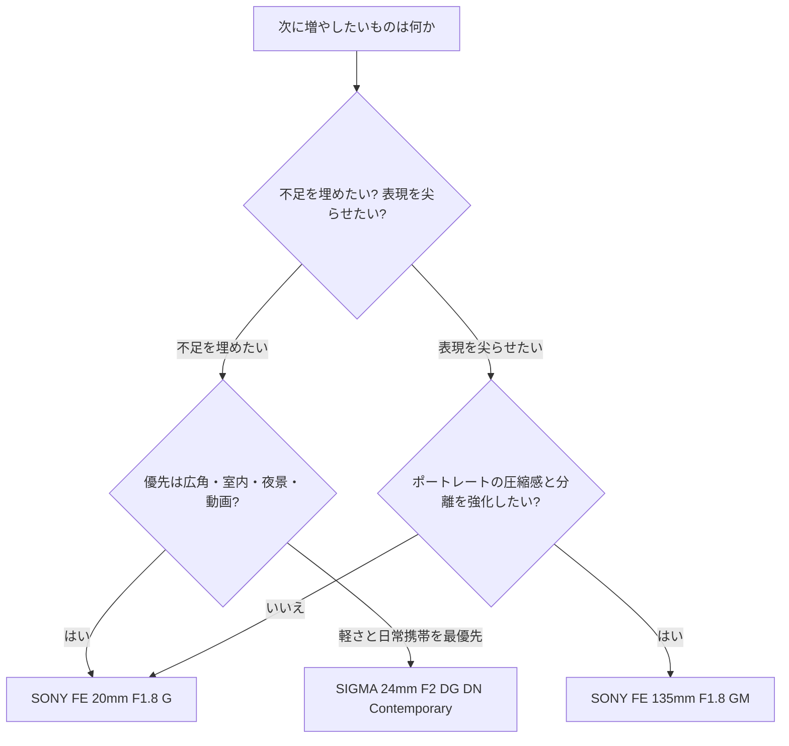

---
tags:
  - 技術/カメラ
  - 文化/写真
source:
  - ChatGPT
  - "ChatGPT_KB"
created: 2026-06-19
updated: 2026-06-07
aliases:
  -
status: draft
---

# 所持機材から見た次に買うべきレンズ

## エグゼクティブサマリー

ChatGPT_KBを優先参照した結果、マスターのシステムは **Sony Eフルサイズ機が3台**、レンズは **16mmから200mmまでほぼ切れ目なくカバー** できています。その一方で、**35〜100mm帯と70〜180mm帯、さらに35/55/85/90mmの単焦点群に重なりが多く、標準〜中望遠域はすでにかなり充実** しています。反対に、**20〜24mm前後の“明るい広角単焦点”が不在** で、ここが一番きれいに埋まる不足です。fileciteturn13file0L3-L3 fileciteturn14file0L3-L3

したがって、**次の一本を一本だけ選ぶなら第一候補は Sony FE 20mm F1.8 G** です。理由は、現在の16-30mm F2.8では埋まらない **低照度・夜景・環境ポートレート・室内・動画** を、一気に広げられるからです。しかも **67mm径** なので、マスターの **67-77mmステップアップリングと77mm磁力フィルター系** に自然に乗ります。これは実運用上かなり大きい利点です。fileciteturn13file0L3-L3 citeturn53view1turn55view0turn56view0

第二候補は **Sony FE 135mm F1.8 GM** です。こちらは「不足を埋める」よりも、**ポートレート表現を一段引き上げる** 一本です。85mm F1.4や70-180mm F2.8をすでに持っていても、135mm F1.8の **圧縮感・背景整理・抜けの良さ・被写体分離** は明確に別物です。ただし、優先度は20mm系より一段下です。理由は、**現状でもポートレート用の戦力が厚い** からです。fileciteturn14file0L3-L3 citeturn53view2turn54view1turn38news1

軽さと日常携帯を重視するなら、代替案は **SIGMA 24mm F2 DG DN | Contemporary** です。これは20mm F1.8ほど“機能差”は大きくありませんが、**α7Cと組んだときの携帯性が非常に良く、24mm単焦点の気持ちよさ** を得やすい一本です。しかも **62mm径** なので、これも既存の **62-77mmリング** をそのまま活かせます。fileciteturn13file0L3-L3 citeturn53view0turn50view0turn50view1

## ChatGPT_KBから読み取れた現状

| 項目 | KBから抽出した内容 | レンズ選びへの意味 | 根拠 |
|---|---|---|---|
| ボディ | α7C / α7IV / α7V のフルサイズEマウントを所持 | すべて **Sony Eフルサイズ用レンズ** 前提でよい。特に α7C があるので、**小型軽量レンズの価値が高い** | fileciteturn13file0L3-L3 |
| 現在のレンズ | 16-30/2.8, 28-200, 35-100/2.8, 70-180/2.8, 35/1.8, 55/1.8, 85/1.4, 90/2.8 Macro | 16〜200mmはほぼ埋まっている。追加は **“焦点距離の穴”より“表現の穴”** を埋めるべき | fileciteturn13file0L3-L3 fileciteturn14file0L3-L3 |
| 主な撮影ジャンル | ポートレート、イベント、スナップ、旅行、風景、室内、夜景ポートレート、マクロ、物撮り | **ポートレート偏重だが、広角・室内・旅行も明確にある**。所以、次は広角単焦点が合理的 | fileciteturn14file0L3-L3 |
| ライティング | AD100Pro II、TT685S、X3S、65cmオクタ等で1灯ポートレート運用可能 | すでに人物撮影の光は作れる。だから **85mm前後をさらに足す優先度は低い** | fileciteturn16file0L3-L3 |
| フィルター運用 | H&Y 77mmマグネット系、55-77 / 62-77 / 67-77 のステップアップリング所持 | **55/62/67mm系の新レンズは導入が楽**。逆に 82mm系は運用が一段重い | fileciteturn13file0L3-L3 |
| KB運用方針 | Deep Researchではまず ChatGPT_KB の要約層のみ参照 | 今回は元ノートを掘らずとも、KBだけで意思決定に足る情報量がある | fileciteturn17file0L3-L3 |

## かぶりと不足

現在のレンズ構成は、**標準〜中望遠の厚みが非常に高い** です。35mmは 35/1.8 と 35-100/2.8、55mmは 55/1.8 とズーム群、85〜90mmは 85/1.4 と 90 Macro、それに 70-180/2.8 と 35-100/2.8 まで重なっています。ポートレート用途に関しては、すでにかなり強い布陣です。fileciteturn14file0L3-L3

一方で、**24mm以下の“明るい単焦点”がありません**。広角は 16-30mm F2.8 でカバーできていますが、F2.8ズームと F1.8〜F2 単焦点では、**夜景・暗所・環境ポートレート・室内・動画の取り回し** がかなり変わります。これは「焦点距離の穴」ではなく、**表現の穴** です。fileciteturn14file0L3-L3

また、もう一つの不足は **135mmクラスの大口径単焦点** です。これは“足りない”というより、**今のポートレートをさらに洗練させる贅沢枠** です。70-180mm F2.8 でも135mm域は撮れますが、135mm F1.8は別表現です。fileciteturn14file0L3-L3 citeturn53view2turn54view1

### 焦点距離と用途のマトリクス

| 帯域 | 現状 | 主用途 | 判定 |
|---|---|---|---|
| 16–24mm | 16-30/2.8 のみ実質担当 | 風景・室内・環境描写 | **不足感あり**。明るい単焦点を足す価値が高い |
| 24–35mm | 28-200、16-30、35/1.8 | 旅行・スナップ・日常 | やや薄いが、**24mm単焦点追加で化ける** |
| 35–70mm | 35/1.8, 55/1.8, 35-100/2.8, 28-200 | スナップ・人物・イベント | **十分以上** |
| 70–100mm | 35-100/2.8, 70-180/2.8, 85/1.4, 90 Macro | ポートレート | **過密** |
| 100–180mm | 70-180/2.8 | イベント・圧縮描写 | 実用十分。ただし **135/1.8で表現強化余地** |
| 180mm超 | 28-200 の端のみ | 旅行の非常用 | 現用途を見る限り、優先度は低い |

ついでに言えば、**今は見送りでよい候補** も明確です。24-70mm F2.8、50mm大口径、85mm系の追加投資は、現状のかぶりをさらに増やしやすく、費用対効果が落ちます。fileciteturn14file0L3-L3

## おすすめの三本

以下の **日本価格は、2026年5月22日時点の国内実売を安定取得できなかったため、実勢感に基づく概算レンジ** として見てください。仕様と性格づけは、公式ページとレビュー/作例ソースに基づいています。citeturn53view1turn53view2turn53view0

| 位置づけ | レンズ | 対応 | 焦点距離 / 開放 | 重量 / サイズ | 光学・AF特徴 | 向く用途 | 長所 | 短所 | 新品相場目安 | 中古相場目安 |
|---|---|---|---|---|---|---|---|---|---|---|
| 第一候補 | **SONY FE 20mm F1.8 G** | Sony E フルサイズ | 20mm / F1.8 | 約373g / 約73.5×84.7mm | OSSなし / XDリニアモーターAF / 絞りリング / 67mm径 | 室内、風景、夜景、環境ポートレート、ジンバル動画 | **今の機材で一番きれいに穴を埋める**。67mm径で既存フィルター系に乗る | 24mm派には少し広い。価格は軽めではない | **約12万〜14万円** | **約9万〜11万円** |
| 第二候補 | **SONY FE 135mm F1.8 GM** | Sony E フルサイズ | 135mm / F1.8 | 約950g / 約90×127mm | OSSなし / XDリニアモーターAF / 82mm径 | 本気のポートレート、イベントの抜き、圧縮描写 | **85/1.4や70-180/2.8と明確に違う画** が出る | 重い。82mm径で現フィルター系から外れる。優先度は20mm系より下 | **約24万〜28万円** | **約17万〜21万円** |
| 代替・軽量路線 | **SIGMA 24mm F2 DG DN \| Contemporary** | Sony E フルサイズ | 24mm / F2 | 約360g / 約70×74mm | OSSなし / ステッピングモーターAF / 金属外装 / 絞りリング / 62mm径 | 旅行、街歩き、建築、室内、軽装スナップ | α7Cとの相性が非常に良い。62mm径で既存リング活用可。コンパクト | 20mmほどの差別化はない。F2なので20/1.8ほどの暗所力ではない | **約8万〜10万円** | **約5.5万〜7万円** |

### 各候補の根拠

**Sony FE 20mm F1.8 G** は、ソニー直販ページで **SEL20F18G / $999.99** と案内されており、超広角単焦点Gレンズとして位置づけられています。Wikipedia要約では **84.7mm長・373g・67mm径・20mm F1.8・XDリニアモーター・防塵防滴配慮** が整理され、digitalkamera.de のレビューでは **67mm径、約375gのコンパクトさ、絞りリングのデクリック、静かで素早いAF** が確認できます。環境ポートレートや動画寄りの一本として、今の構成に最も自然です。citeturn53view1turn55view0turn56view0

**Sony FE 135mm F1.8 GM** は、ソニー直販で **SEL135F18GM / $2,249.99**。Digital Camera World は **Sony FE系のベストポートレートレンズ** として挙げ、**Dual XD linear motors、82mm径、90×127mm、950g、0.7m最短、0.25倍** を示しています。現在の85mm F1.4と70-180mm F2.8の間を埋めるというより、**ポートレートの質感を別次元に持っていく** レンズです。citeturn53view2turn54view0turn54view1turn38news1

**SIGMA 24mm F2 DG DN | Contemporary** は、公式ページで **F2の明るさ、バランスの良いボディサイズ、中心から周辺までの高い解像、サジタルコマフレア抑制、静粛かつ高速なステッピングモーターAF** が示されています。公式の使用レポートでも、**旅行・建築・風景での軽快さ** と **Iシリーズらしいコンパクトさ・金属感・高画質** が繰り返し強調されています。α7Cの“持ち出したくなる一本”としては、かなり相性が良いです。citeturn53view0turn50view0turn50view1

### 公式ページと参照リンク

**Sony FE 20mm F1.8 G**  
公式: citeturn53view1  
レビュー参照: citeturn56view0  
レビュー/評価要約: citeturn55view0  

**Sony FE 135mm F1.8 GM**  
公式: citeturn53view2  
レビュー参照: citeturn54view0turn54view1  
比較ガイド参照: citeturn38news1  

**SIGMA 24mm F2 DG DN | Contemporary**  
公式: citeturn53view0  
作例・使用感参照: citeturn50view0  
作例・使用感参照: citeturn50view1  

## 買い分けフローチャート

## 買う前の試し方

最も効率の良い試し方は、**今持っている近いレンズと同じ場所・同じ被写体・ほぼ同じ立ち位置で比較すること** です。これで「本当に差があるか」が明確になります。

**Sony FE 20mm F1.8 G を試す場合** は、今の **16-30mm F2.8 を20mmに合わせて** 比較してください。室内、夜景、人物を入れた環境ポートレートの3場面で、  
`20mm / F1.8 / 1-125s / ISO Auto上限6400`  
`20mm / F2.8 / 1-125s / ISO Auto上限6400`  
を撮り比べると、**背景整理、シャッター速度余裕、ISO差、周辺の見え方** が一発で分かります。

**Sony FE 135mm F1.8 GM を試す場合** は、**70-180mm を135mm F2.8** に固定し、さらに **85mm F1.4 で一歩寄った写真** も撮ってください。  
`135mm / F1.8 / 1-500s / ISO Auto`  
`135mm / F2.8 / 1-500s / ISO Auto`  
`85mm / F1.4 / 1-500s / ISO Auto`  
を並べると、**背景の圧縮感、抜け、顔の立体感、撮影距離の快適さ** が見えます。

**SIGMA 24mm F2 DG DN** は、**16-30mmの24mm** と **35mm F1.8** の間に置いて考えるのが適切です。  
`24mm / F2 / 1-250s / ISO Auto`  
`24mm / F2.8 / 1-250s / ISO Auto`  
`35mm / F1.8 / 1-250s / ISO Auto`  
の三比較で、**広さ・ボケ・携帯性のどこに魅力を感じるか** を確かめると失敗しにくいです。

試す場所は、**室内、夕方の街、人物を入れた一枚、旅先を想定した街角** の4種類で十分です。レンタルでも店頭実機でも構いませんが、**同日・同条件・RAWで比較** してください。その一手で判断精度が大きく上がります。

## 前提と制限

今回の判断は、**Vault全体ではなく ChatGPT_KB の要約層を優先参照する** という方針に従っています。KBには、今回の意思決定に必要な **機材一覧、用途、ライティング、運用方針** が十分含まれていたため、元ノートの深掘りは行っていません。fileciteturn17file0L3-L3

未確定の前提もあります。具体的には、**予算上限、ブランド優先度、静止画と動画の比率、ポートレートと旅行のどちらを上位に置くか** はKBからは確定できません。そのため、今回は  
**汎用性最大 = FE 20mm F1.8 G**  
**表現特化 = FE 135mm F1.8 GM**  
**軽快性重視 = SIGMA 24mm F2 DG DN**  
という三分岐で結論を出しました。

私の最終結論は明確です。  
**一本だけ買うなら、最初の一本は Sony FE 20mm F1.8 G。**  
**“刺さる画”を増やしたいなら、次点で Sony FE 135mm F1.8 GM。**  
**軽さと持ち出しやすさを優先するなら、SIGMA 24mm F2 DG DN。**
