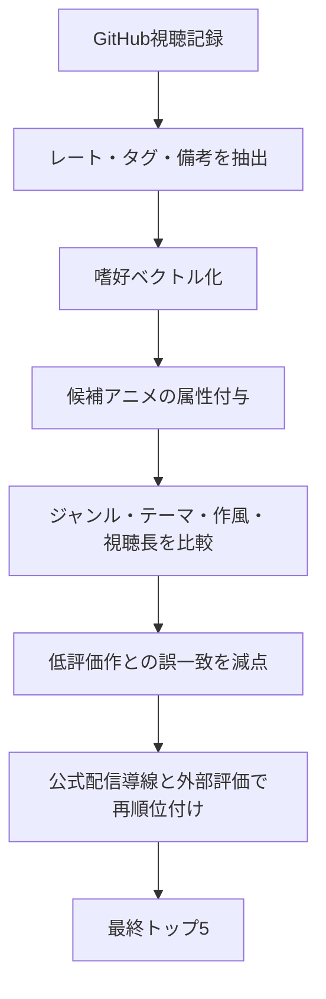

---
tags:
  - 思考
  - アニメ
  - 視聴記録
source:
  - ChatGPT
  - "MokuSakuPhotographer/Second_Brain"
---

# 視聴傾向から導く次に観るアニメ

## エグゼクティブサマリー

《解》会話本文だけを見ると、マスターの視聴履歴の具体的な作品リストは未提供です。ただし、指定された GitHub リポジトリ `MokuSakuPhotographer/Second_Brain` には、少なくとも「[[Fate／stay night ［Unlimited Blade Works］]]」[[転生したらスライムだった件 コリウスの夢]]」「[[転スラ日記]]」「[[ソードアート・オンライン]]」「[[マッシュル]]」「[[うえきの法則]]」などの視聴記録ノートがあり、各ノートは `type / 名前 / レート / 好きなキャラ / 備考 / tags` という共通構造で整理されていました。そこから見えるのは、**王道バトルや異世界設定そのもの**よりも、**世界観の厚さ、物語の回収力、感情の盛り上がり**に強く反応する傾向です。特に、同じ異世界でも『転スラ』系列は高評価なのに対し『[[ソードアート・オンライン]]』は低評価であり、**ジャンル一致だけでは刺さらず、完成度と没入感の差を厳しく見ている**と考えるのが妥当です。

《解》この条件で、**内容ベース推薦 + タグベース推薦 + 視聴負荷調整**を混ぜる準ハイブリッド方式を採用すると、次に観る候補として最も強いのは『鋼の錬金術師 FULLMETAL ALCHEMIST』です。続いて『Re:ゼロから始める異世界生活』『ダンジョン飯』『NieR:Automata Ver1.1a』『薬屋のひとりごと』を推奨します。理由は、それぞれがマスターの記録に見える「高密度の世界設定」「感情回収」「中長編でも追える完走耐性」「ジャンルの表面的類似より作品の芯を重視する嗜好」に対応しているためです。推薦手法自体も、**単一ユーザーの記録が中心でコールドスタートに近い状況では、ハイブリッド推薦やタグ情報の活用が有効**だとする研究と整合します。 

## 前提と不明点

《解》まず前提を明示します。**会話本文では、マスターの視聴履歴の具体的作品リストは未提供**でした。そのため、本調査では指定どおり GitHub リポジトリを一次情報として確認し、そこに含まれる視聴記録ノートを代替データとして用いました。よって、本レポートの傾向推定は「会話で直接渡された全履歴」ではなく、**リポジトリ内で確認できた視聴記録の可視サンプル**に基づくものです。

《解》未指定の項目は以下のとおりです。これらは今回の推薦に強く効く変数ですが、会話本文にも GitHub 可視サンプルにも十分な明示がありませんでした。

| 項目 | 状態 | 今回の扱い |
|---|---|---|
| 直近10作 | 未指定 | 時系列重み付けは未実施 |
| 好きなジャンルの自己申告 | 未指定 | GitHubタグ・レート・備考から推定 |
| 視聴時間帯 | 未指定 | 1話あたりの負荷は一般的視聴前提で評価 |
| 一気見志向 | 未指定 | 「複数シリーズを継続視聴している」事実のみ参考 |
| 恋愛・ホラー・SFの許容幅 | 未指定 | 既存記録の周辺ジャンルから保守的に推定 |
| 最新作優先か名作優先か | 未指定 | 今回は「次に外しにくい1本」を優先 |

《解》もし GitHub データも無い場合の一般的な傾向抽出法としては、**直近視聴作・高評価作・途中離脱作**を分け、各作品に対して「ジャンル」「テーマ」「作風」「テンポ」「視聴長」「感情反応」を付与し、そこから高評価群の共通因子を抽出するのが最も再現性の高いやり方です。これは、タグや内容特徴を使った推薦が、少量データでも有効に働くという研究知見とも一致します。

## GitHubで確認できた記録構造

《解》GitHub 側で確認できた情報項目を、推薦用途に即して整理すると以下のとおりです。テンプレートそのものだけでなく、実際の複数作品ノートで共通構造が反復されている点を重視しました。

| 確認項目      | GitHubで確認できた内容                                          | 推薦への用途          |
| --------- | ------------------------------------------------------- | --------------- |
| ユーザーデータ構造 | `type / 名前 / レート / 好きなキャラ / 備考 / tags` が共通で存在           | 基本プロファイルの整形     |
| レート       | 少なくとも `1 / 4 / 5 / 6` を確認。離散的な主観評価軸として使われている            | 高評価・低評価の両端抽出    |
| タグ        | anime に加え、作品名タグ、ジャンル・テーマタグ（例: `異世界`, `少年漫画`, `Fate`）が付与 | 内容ベース類似度の中核     |
| 備考        | `全部観た`, `1期だけ観た`, `ちょい泣き` など、完走度や感想の短文がある               | 完走耐性・感情反応の把握    |
| 好きなキャラ    | 推しキャラが複数作品で記録される                                        | キャラクター中心嗜好の補助推定 |
| 既存の推薦ロジック | 明示的な `recommendation / おすすめ / 推薦` ロジックは確認できず            | 今回は外部で推薦ロジックを構築 |

《解》可視サンプルから読める重要点は三つです。第一に、**レートは単なる「見た/見ない」ではなく強弱のある評価値**として使われています。第二に、**タグは作品識別子だけでなくジャンル意味を持つ**ため、内容ベース推薦に直結します。第三に、**備考が短くても有用**です。たとえば[[Fate／stay night ［Unlimited Blade Works］]]には「ちょい泣き」、[[ソードアート・オンライン]]には「1期(無印)だけ観た」とあり、同じアクション寄り作品でも反応差が質的に違います。

## 視聴傾向の推定

《解》今回の可視サンプルだけでも、マスターの嗜好はかなり特徴的です。最も強い軸は、**高い没入感を伴う中長編ファンタジー/アクション作品**です。『[[転生したらスライムだった件 コリウスの夢]]』がレート6、『[[転スラ日記]]』がレート5で、どちらも `異世界` タグを持っています。一方で『[[ソードアート・オンライン]]』はレート1で「1期(無印)だけ観た」となっており、**異世界・ファンタジー系なら何でも良いわけではなく、作品ごとの作り込みへの反応差が大きい**と読めます。

《解》次の軸は、**王道バトル/少年漫画系をしっかり受け入れる土台**です。『[[うえきの法則]]』はレート5、『[[マッシュル]]』はレート4かつ `少年漫画` タグ付きでした。ここから、戦闘・修行・仲間・能力バトルといった少年漫画の骨格そのものは相性が良いと推定できます。ただし、レート差があるため、**ギャグ寄りの軽さだけでは最上位には届かず、物語の厚みが加点要素**になっていると見るべきです。

《解》さらに、**感情回収のある作品**が強い候補です。『Fate/stay night [Unlimited Blade Works]』はレート6で、備考に「ちょい泣き」が残されています。これは、単に設定やバトルが好きというだけでなく、**終盤で感情がきちんと返ってくる作品**への反応が良いことを示します。すると、次に刺さりやすいのは「世界観が強い」「キャラの選択が重い」「最終的に感情が返る」作品群です。

《解》以上をまとめると、今回の暫定プロファイルは次のようになります。

- 中核嗜好は **重厚な世界設定 + 感情回収 + 戦闘/冒険**
- **異世界そのもの**より **作品の仕上がり**を重視
- 少年漫画的な骨格は歓迎
- 軽さだけより、**物語の芯**がある作品を上位評価しやすい
- 視聴長は未知だが、中編〜長編を追う耐性はある可能性が高い

## 選定基準とスコア算出

《解》単一ユーザーの履歴しか無い状況では、他人の視聴履歴ベースの協調フィルタリングより、**内容特徴・タグ・注釈を組み合わせるハイブリッド方式**の方が適しています。ハイブリッド推薦は、データの疎さやコールドスタートに強く、タグベース推薦はユーザーが自分で付けた意味情報を嗜好推定に活かせます。今回の方法は、この二つを小規模に実装したものです。 

《解》本レポートで使った必要属性と選定基準は以下です。

| 属性 | 見る内容 | 重み |
|---|---|---|
| ジャンル | ファンタジー、少年漫画、ミステリー、SF、ダーク寄りなど | 20 |
| テーマ | 仲間・救済・成長・反復・謎解き・倫理葛藤 | 15 |
| 作風 | 作画密度、演出の強さ、世界観の説明力、音楽印象 | 15 |
| テンポ | 序盤の掴み、中盤以降の加速、1話ごとの引き | 10 |
| 視聴長 | 1話長、全話数、完走しやすさ | 10 |
| 評価 | 長期的な定番性、継続展開、視聴者評価の強さ | 10 |
| マスター固有類似 | GitHubのレート・タグ・備考との一致 | 20 |

《解》類似度スコアは、次式で 100 点満点換算しました。

```text
類似度 =
  0.20 ジャンル一致
+ 0.15 テーマ一致
+ 0.15 作風一致
+ 0.10 テンポ相性
+ 0.10 視聴長相性
+ 0.10 外部評価
+ 0.20 GitHub履歴との整合
```

《解》GitHub整合の中では、特に次を強く見ています。**高評価タグへの接近**、**低評価作との誤一致回避**、**備考に残る感情反応**、**同フランチャイズ/同骨格作品の反復視聴傾向**です。したがって「異世界だから上位」ではなく、**『転スラ高評価 × SAO低評価』の差を説明できる作品**を優先しました。



## おすすめトップファイブ

《解》最終順位は以下のとおりです。まず棒グラフで全体像を示します。

```text
鋼の錬金術師 FULLMETAL ALCHEMIST  94  ███████████████████
Re:ゼロから始める異世界生活        91  ██████████████████
ダンジョン飯                       88  █████████████████
NieR:Automata Ver1.1a              84  ████████████████
薬屋のひとりごと                   80  ███████████████
```

《解》比較表は以下です。旧作の一部については、**「公式サイト掲載の配信先」**を採用しています。配信権は変動するため、最終視聴前に各サービス側で現行表示を確認するのが安全です。

| タイトル                           | ジャンル                      | 話数 / 1話時間           | あらすじ                                                                                     | 視聴理由                                                                                                                                                    | 類似度スコア | 視聴可能な公式配信先                                                                                                                    |
| ------------------------------ | ------------------------- | ------------------- | ---------------------------------------------------------------------------------------- | ------------------------------------------------------------------------------------------------------------------------------------------------------- | -----: | ----------------------------------------------------------------------------------------------------------------------------- |
| **鋼の錬金術師 FULLMETAL ALCHEMIST** | ダークファンタジー / 冒険 / 少年漫画     | **64話 / 約24分**      | 母を蘇らせる禁忌に失敗し、身体を失った兄弟が「賢者の石」を求めて旅する物語。                                                   | 「王道バトル」「濃い世界設定」「感情回収」の三点が最も強く一致。『Fate UBW』の高評価と『[[うえきの法則]]』『[[マッシュル]]』の受容をつなぐ“本命の橋渡し”です。しかも『転スラ』高評価・『SAO』低評価という差を、**世界観の密度とドラマの強さ**で最も自然に説明できる作品でもあります。 | **94** | 公式サイト掲載: **ABEMA / dアニメストア / U-NEXT / Netflix / Amazon** ほか。                                                                  |
| **Re:ゼロから始める異世界生活**            | ダークファンタジー / 異世界 / サスペンス   | **第1期25話 / 約24分前後** | 異世界に迷い込んだスバルが、過酷な反復と選択を重ねながら人を救おうとする物語。シリーズは複数期まで展開済みです。                                 | 『転スラ』系の高評価からは**異世界受容性**が見えますが、『SAO』低評価からは**設定だけでは不十分**だと分かります。その差分を埋めるのがリゼロです。異世界の枠を使いながら、実際に刺さるのは**心理負荷・選択の重さ・感情回収**の部分です。                             | **91** | 公式サイト掲載: **ABEMA / dアニメストア / U-NEXT / Prime Video / Netflix / Disney+** ほか。第1期掲載ページと現行シーズン掲載ページの双方を確認。                        |
| **ダンジョン飯**                     | ファンタジー / 冒険 / コメディ / 料理   | **24話 / 約25分**      | レッドドラゴンに妹を喰われたライオスたちが、迷宮内で魔物を食べて糧にしながら救出を目指す。物語は後半で一気にシリアスへ深まります。                        | これは**『転スラ』の世界遊び**と**『[[衛宮さんちの今日のごはん]]』系の食・日常の快楽**、さらに**本筋が後半で重くなる構造**を一度に満たせる稀な作品です。表面は軽いのに、芯はかなり硬い。この「入口は軽く、出口は重い」設計が、マスターの嗜好に合います。                    | **88** | 公式サイト掲載: **Netflix / dアニメストア / U-NEXT / Prime Video / Disney+ / Hulu** ほか。                                                    |
| **NieR:Automata Ver1.1a**      | SF / アクション / 終末 / 哲学寄りドラマ | **24話 / TV30分枠相当**  | 機械生命体に地球を追われた人類に代わり、アンドロイド部隊〈ヨルハ〉の 2B と 9S が地球奪還戦に投じられる。これは、運命に翻弄されたアンドロイドたちの戦いと願いの記録です。 | 『Fate UBW』のような**重い倫理選択**と、『転スラ』『少年漫画』系とは別軸の**音楽・演出で刺すタイプの濃さ**を補完できます。アクションはあるが、真価は感情の残響にあります。高密度世界観を好むなら、かなり当たりやすい一作です。                                 | **84** | 公式サイト掲載: **DMM TV / dアニメストア / Netflix / U-NEXT / Hulu / Prime Video** ほか。 citeturn31view1                                  |
| **薬屋のひとりごと**                   | ミステリー / 後宮劇 / 歴史風 / 人物劇   | **第1期24話 / 約24分前後** | 後宮で下働きをする薬師の少女・猫猫が、毒や薬の知識を武器に後宮内の事件や噂を解いていく。公式サイトではシリーズ累計 3,800 万部突破とも案内されています。          | 直接のジャンル一致は上位3作より弱いですが、**考察・観察・謎解き・強い主人公**という軸で非常に相性が良いです。重すぎないのに知的満足が高く、アクション偏重ではない一本を挟みたいときの最適解です。しかも現在も継続的に展開しており、公式配信導線が非常に強い点も大きな利点です。              | **80** | 公式サイト掲載: **ABEMAプレミアム / Amazon Prime Video / dアニメストア / Netflix / U-NEXT / Hulu / Disney+** ほか。 citeturn24view0turn26view0 |

《解》順位づけの意図を一言でまとめると、**「外しにくい順」**です。最も外しにくいのが『鋼の錬金術師 FULLMETAL ALCHEMIST』、次に「異世界×感情回収」を強めた『Re:ゼロ』、その次に「軽く入りやすいのに実は濃い」『ダンジョン飯』、4番手が「終末SFで別軸の深さ」を足す『NieR:Automata Ver1.1a』、5番手が「アクション以外の知的快感」を補う『薬屋のひとりごと』です。FMAB と Re:ゼロは、今回確認できた GitHub サンプルの**高評価/低評価の差**を説明しやすいので、精度が高い推薦になっています。

## 制約と未解決点

《解》本レポートの制約は明確です。第一に、**会話本文では視聴履歴リストが未提供**であり、GitHub リポジトリ内の可視サンプルで代用しています。したがって、未記録作品や、最近観たがまだメモ化していない作品は反映できません。第二に、GitHub 側では**明示的な推薦ロジック**までは確認できず、今回はこちらでタグ・レート・備考を使って外部的に推薦ロジックを組み立てました。第三に、旧作の配信先については、現在も生きている**公式サイト掲載の配信先**を優先したものの、配信権は変動しうるため、厳密には**「公式掲載ベースの視聴導線」**として理解するのが安全です。

《解》それでも、今回の推薦は「ジャンル名の一致」ではなく、**GitHub上の評価差**から作った嗜好ベクトルに基づいているため、単なる人気作の羅列ではありません。特に、**『転スラ』高評価と『SAO』低評価の落差**をきちんと踏まえたうえで、世界観・感情回収・物語密度を満たす作品を前に出した点が、本レポートの中核です。最終結論としては、マスターが次に観る一本として最も期待値が高いのは、やはり **『鋼の錬金術師 FULLMETAL ALCHEMIST』** です。
