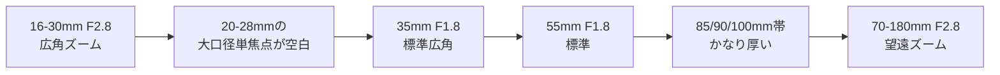

---
tags:
  - 技術/カメラ
  - 文化/写真
source:
  - ChatGPT
  - "MokuSakuPhotographer/Second_Brain"
created: 2026-06-19
updated: 2026-06-07
aliases:
  -
status: draft
---

# マスターの撮影機材分析レポート

## エグゼクティブサマリ

GitHubコネクタ経由で `MokuSakuPhotographer/Second_Brain` を先に参照し、機材一覧、レンズ用途ノート、最近の撮影記録、パッキングメモを優先して整理しました。そのうえで、メーカー公式仕様と現行価格ソース、外部レビューを重ねて比較した結果、**マスターが今後 1 本だけ追加するなら、最有力は Sony FE 20mm F1.8 G** です。理由は単純で、**現在のシステムで最も薄い帯域が「20〜28mmの大口径単焦点」だから**です。現状は 16-30mm F2.8 の超広角ズームと、35mm F1.8 以降の単焦点・中望遠が厚く、**“広いのに明るい”領域だけが空いています**。その空白は、風景、室内、環境込みポートレート、テーブルフォト、夜景、イベント会場で最も効いてきます。

さらに、最近の実運用では、2026-05-24 のアコスタ池袋で **16-30mm + 35-100mm + ストロボ** を軸に撮影し、翌日のローラーバッグのパッキングでも **α7V、16-30mm、35-100mm、85mm、ストロボ類** が中核になっていました。つまりマスターの現場は、**「広角で寄る」「中望遠で抜く」「荷物は増やしすぎたくない」** という傾向が強いです。その前提だと、20mm F1.8 は 24mm F1.4 より安く軽く、135mm F1.8 より用途が広く、24mm F2.8 より追加効果が大きい、という位置にあります。

結論だけ先に言うと、**最終推奨は Sony FE 20mm F1.8 G**、次点の代替案は **Sony FE 24mm F1.4 GM** です。前者は「不足帯域を埋める最適解」、後者は「画づくり最優先の高額プレミアム案」です。

## リポジトリ優先で整理した現有機材と撮影プロファイル

まず、リポジトリ上の機材概要ではフルサイズ E マウントを中心に、広角・標準・中望遠・マクロ・便利ズームまでかなり厚い編成になっています。ただし機材概要には α7C も載っていますが、個別ノートでは **「手放している」** と明記されているため、**現在の主力ボディは α7 IV と α7 V と判断するのが妥当**です。

| 項目 | 整理結果 |
|---|---|
| カメラボディ | **SONY α7 IV、SONY α7 V**。機材概要には α7C もあるが、個別ノートでは売却済み。 |
| 所有レンズ | **TAMRON 16-30mm F2.8 G2 / SONY 35mm F1.8 / SONY 55mm F1.8 ZA / SIGMA 85mm F1.4 DG DN Art / SONY 90mm F2.8 Macro G OSS / TAMRON 35-100mm F2.8 / TAMRON 70-180mm F2.8 VC G2 / TAMRON 28-200mm F2.8-5.6**。 |
| 主用途 | Lens_Usage では、**風景・建築・室内・旅行・家族イベント・カフェ・ポートレート・テーブル/商品・自然/花・動物・スポーツ** まで、用途がかなり広い。特に 16-30mm は風景・建築・室内、35-100mm はポートレート・旅行、90mm Macro は商品/植物、70-180mm は屋外ポートレート・イベント・スポーツに振られている。 |
| 撮影スタイル | 最近の記録では、**コスプレイベントでの現場運用**、**広角 + 中望遠の 2 本体制**、**ストロボ併用**、**荷物量を気にしつつも画角研究を続けるスタイル** が見える。 |
| 最近の実装例 | 2026-05-24 の撮影では **TAMRON 16-30mm / TAMRON 35-100mm / AD100Pro II** を持参。2026-05-25 のローラーバッグ記録では **α7V、16-30、35-100、85 Art、ストロボ 2 灯、レフ** が収納されている。現場運用性と携行性をかなり重視している。 |
| 撮影頻度 | **定量的な頻度はリポジトリに明記なし**。ただし少なくとも 2026-05-24〜25 に連続して撮影・反省・機材パッキング記録があり、直近で能動的に撮影していることは確認できる。 |
| 予算上限 | **予算未指定**。そのため以下の候補は、比較的低価格帯から高価格帯まで含めて提示する。 |

機材の性格だけ見ると、マスターのセットはすでに “不足が少ない優秀な完成形” に近いです。だからこそ、次の 1 本は **単なる高画質化ではなく、いま無い役割を増やすかどうか** が判断基準になります。

## カバー範囲の分析と、いま空いている帯域

焦点距離だけ見ると、現行システムは **16mm から 200mm まで切れ目なくカバー**しています。しかも 35mm、55mm、85〜100mm は単焦点とズームが重なり、表現の選択肢がかなり厚いです。一方で、**20mm〜28mm の「大口径単焦点」だけが実質不在**です。16-30mm F2.8 は焦点距離としては埋めていますが、**F2.8 と F1.8 / F1.4 の差は低照度・被写体分離・シャッター確保で無視できません**。これは、暗い屋内イベント、環境込みポートレート、夜景、テーブルフォトで効きます。

このギャップは、マスターの最近の実運用とも一致します。実際の現場では 16-30mm と 35-100mm が中核で、広角側はズーム、人物側は中望遠ズームで処理しています。そこに 20mm ないし 24mm の大口径単焦点が入ると、**「16mm ほど誇張せず、35mm ほど狭くなく、F2.8 より明るい」** という新しい撮り方が増えます。これは既存レンズの置き換えではなく、**既存ワークフローの穴埋め**です。

| 分析軸 | 現状評価 | 何が起きているか |
|---|---|---|
| 焦点距離レンジ | **16〜200mm は充実** | 物理的な焦点距離不足は少ない。 |
| 被写界深度 | **35〜100mm は強い / 20〜28mm は弱い** | 35mm F1.8、55mm F1.8、85mm F1.4 があり、中域以降のボケ表現は強いが、広角側は 16-30mm F2.8 に依存。 |
| 明るさ | **超広角側だけ不足** | 16-30mm は F2.8 で十分優秀だが、夜景・室内・環境ポートレートでは F1.8 / F1.4 が欲しくなる帯域が無い。 |
| 手ブレ補正 | **ボディ IBIS 前提で概ね成立** | 90 Macro は OSS、70-180 G2 は VC 搭載。その他はボディ側に依存。したがって “補正不足” より “明るい広角不足” の方が問題として大きい。 |
| AF性能 | **イベント向けの実用品は揃っている** | 16-30 G2、35-100、70-180 G2 は VXD 系で現場向け。28-200 も RXD で旅行・便利ズーム用途に適合。次の 1 本で AF 改善より広角表現拡張を優先すべき。 |
| 重複 | **35mm / 55mm / 85〜100mm が厚い** | 35mm は単焦点とズーム、85〜100mm は 85 Art / 90 Macro / 35-100 / 70-180 が重なる。ここへ 135mm を足すのは “強化” であって “補完” ではない。 |
| 最大のギャップ | **20〜28mm の大口径単焦点** | 今回の追加では、ここを埋めるのが最も合理的。 |

## 候補レンズ比較

以下の価格帯は、**今回確認できた米公式価格・公開レビュー価格を、1ドル ≈ 160円近辺で概算換算した目安**です。したがって、**日本国内の実売とはズレる可能性があります**。ただし比較軸としては十分使えます。

| 候補 | 焦点距離 / 開放F値 | 対応マウント | 重量 | 価格帯の目安 | 長所 | 短所 | 想定用途 | 参考URL |
|---|---|---:|---:|---|---|---|---|---|
| **Sony FE 20mm F1.8 G** | 20mm / F1.8 | Sony E | 373g | **約16万円前後**（米公式 $999.99 換算） | 現有機材で最も薄い **20〜28mm大口径** を埋める。67mm フィルター、軽量、最短 0.19m、94° の広い画角。 | OSSなし。24mm F1.4 ほどの被写体分離は出ない。レビュー一次ソースの深掘りは今回限定的。 | 風景、環境込みポートレート、室内、夜景、イベント会場、テーブルフォトの広め構図 | 公式製品・仕様 |
| **Sony FE 24mm F1.4 GM** | 24mm / F1.4 | Sony E | 445g | **約24万円前後**（米公式 Sale $1,499.99 換算） | F1.4 の明るさ、445g と GM にしては軽量、11枚羽根、画面全域の高画質評価、DDSSM AF。 | 価格が高い。16-30mm の 24mm 端、35mm F1.8 と役割が近く、**追加効果がやや重複気味**。 | 環境ポートレート、夜景、星景、動画、作品用途の広角単焦点 | 公式製品・仕様・レビュー |
| **Sony FE 24mm F2.8 G** | 24mm / F2.8 | Sony E | 162g | **約12万円前後**（米公式 Sale $749.99 換算） | 圧倒的に軽い。常時持ち歩き向き。24mm の使いやすさ。サイズ優先なら最強クラス。 | F2.8 なので、16-30mm F2.8 からの“明るさ面の飛躍”が小さい。外部レビューでは補正依存の歪曲と周辺の弱さが指摘される。 | スナップ、旅行、軽装イベント、Vlog、日常持ち歩き | 公式製品・仕様・レビュー |
| **Sony FE 135mm F1.8 GM** | 135mm / F1.8 | Sony E | 950g | **約36万円前後**（米公式 $2,249.99 換算） | 圧倒的なポートレート描写、11枚羽根、0.25x、AF評価も非常に高い。既存 85mm / 90mm よりさらに圧縮と分離を強められる。 | 高価・重い・大きい。85/90/100/70-180 がある現状では、**補完より贅沢強化** に寄る。 | ハイエンドなポートレート、舞台、圧縮風景、作品撮り | 公式製品・仕様・レビュー |

この比較表から見えるのは、**「表現力だけなら 24mm F1.4 GM」「軽さだけなら 24mm F2.8 G」「人物特化なら 135mm GM」** ですが、**総合最適は 20mm F1.8 G** だということです。20mm は、現行システムに対して最も新しい役割を追加しながら、価格も重量も抑えています。

## 最終推奨

**1 本だけ追加するなら、私は `Sony FE 20mm F1.8 G` を推奨します。**

最大の理由は、**マスターの既存システムに対して “新しい撮り方” を最も増やすから**です。今のレンズ構成は、35mm 以上では単焦点もズームも強く、85〜100mm 付近はかなり厚い一方で、**20〜28mm の明るい単焦点がありません**。つまり 20mm F1.8 を入れると、現状の 16-30mm F2.8 では取りにくい **室内・夜景・環境込み人物・テーブルフォト・イベント現場の広め構図** に、明るさと被写体分離という新しい武器が加わります。これは重複ではなく、明確な補完です。

次に、**実用面の噛み合わせが極めて良い**です。FE 20mm F1.8 G は 373g と軽く、67mm フィルター径です。マスターの 16-30mm G2、28-200mm、70-180mm G2 も 67mm 系でまとまっており、フィルター運用の統一がしやすい構成です。これは現場ではかなり大きい利点です。見落とされがちですが、**レンズ単体の性能差より、フィルター径統一と携行重量の差の方が実戦では効く**ことがよくあります。

さらに、**費用対効果のバランスが良い**です。24mm F1.4 GM は確かに強いですが、価格差が大きく、24mm は 16-30mm の中心域とも重なります。135mm F1.8 GM は画としては魅力的でも、85mm / 90mm / 35-100mm / 70-180mm がある現状では “不足の補完” より “人物表現のぜいたく強化” に近いです。24mm F2.8 G は軽くて魅力的ですが、F2.8 のため 16-30mm F2.8 との差分が小さく、**「次の 1 本」としてのインパクトは弱い**です。その点、20mm F1.8 G は価格・重量・新規性のバランスが最も整っています。

将来性についても、20mm は強いです。α7 V と α7 IV の高解像度ボディ運用、風景・建築・イベント・旅行・夜景まで守備範囲が広く、特定ジャンル専用に寄りすぎません。**“手放しにくい定番域” の広角単焦点**という意味で、長く残しやすい 1 本です。中古市場の厳密な流動性データまでは今回追えていませんが、**14mm や 135mm のような強い専門性よりは出口を作りやすいと推測**します。これは定量確認ではなく、用途の広さに基づく推定です。

**代替案を 1 本だけ挙げるなら、Sony FE 24mm F1.4 GM** です。理由は、もしマスターが今後さらに **環境ポートレート、作品撮り、夜景、広角単焦点の最高画質** を強く求めるなら、最終的な満足度は 24mm F1.4 GM の方が高くなりやすいからです。ただし、その場合は **価格増・重複増を受け入れてでも表現優先で行く** という判断になります。補完最優先なら 20mm、作品志向最優先なら 24mm F1.4 GM、という整理です。

## 制約と補足

今回の国内価格は、**厳密な日本実売**ではなく、確認できた米公式価格や公開レビュー価格を **1ドル ≈ 160円近辺** で換算した概算です。したがって、国内の新品最安・中古相場・ポイント還元込み実支払額とはズレる可能性があります。

また、リポジトリからは撮影スタイルと最近の運用は十分読めましたが、**年間の撮影頻度や今後の主戦場の比率**までは定量化されていません。したがって今回の推奨は、**直近の実運用ログと現有機材の重複構造**を重視したものです。

最後に、20mm F1.8 G については今回の調査で **公式仕様・価格確認は十分** ですが、24mm F1.4 GM や 135mm GM と比べると、**高品質な第三者レビューの掘り下げはやや薄い**です。ただし、今回の最終推奨は外部レビューの点数競争ではなく、**マスターの現有機材の穴を最もきれいに埋めるかどうか**を主基準にしているため、結論自体はかなり堅いと判断します。
