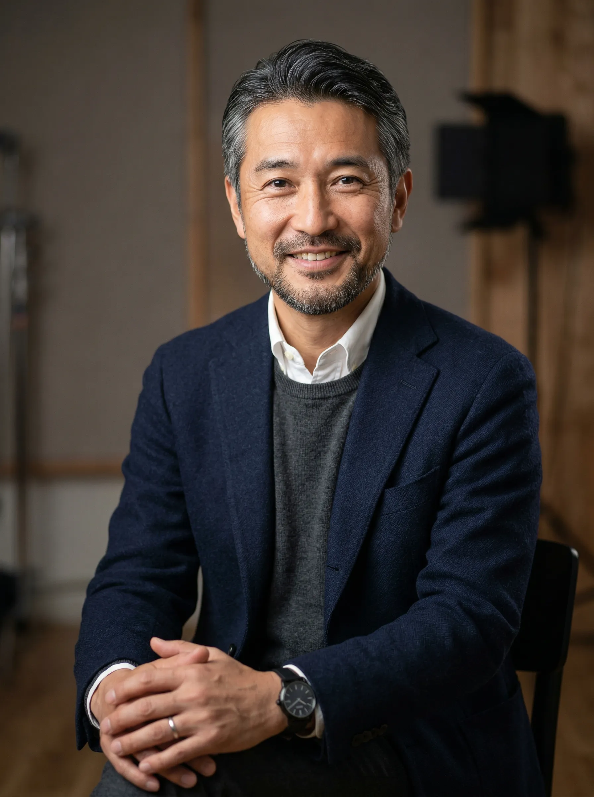
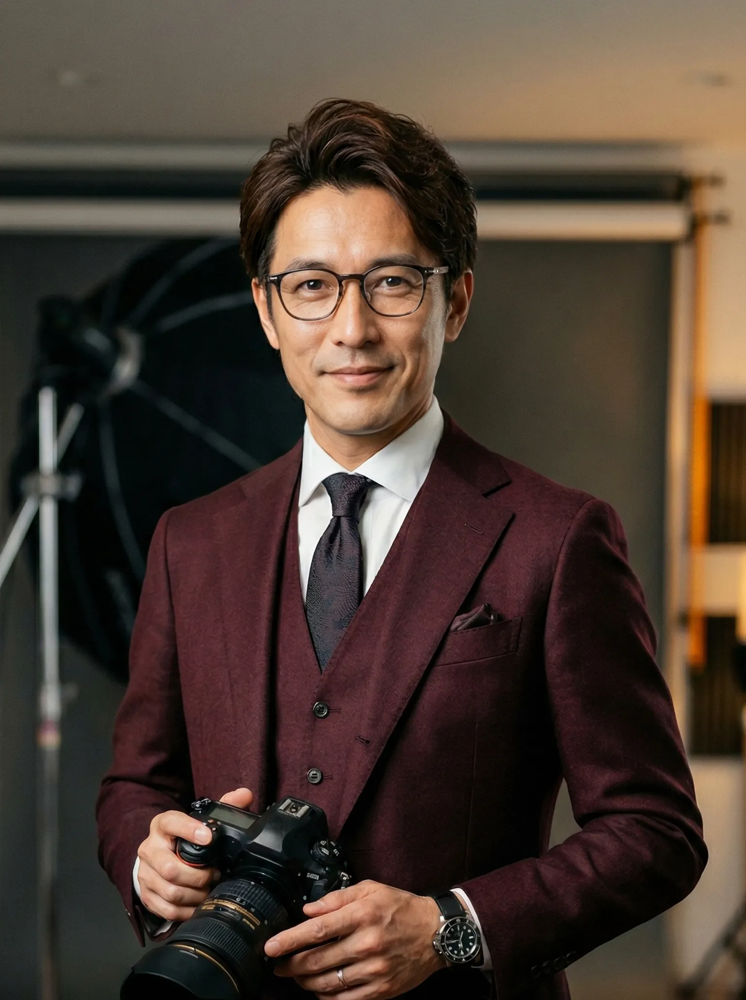
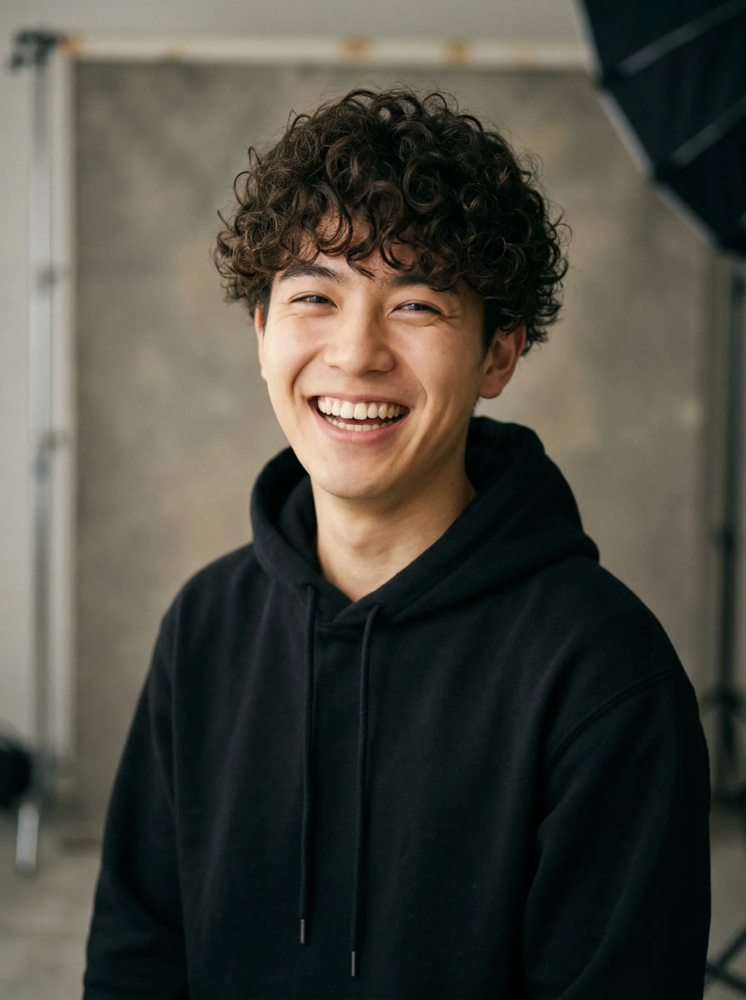
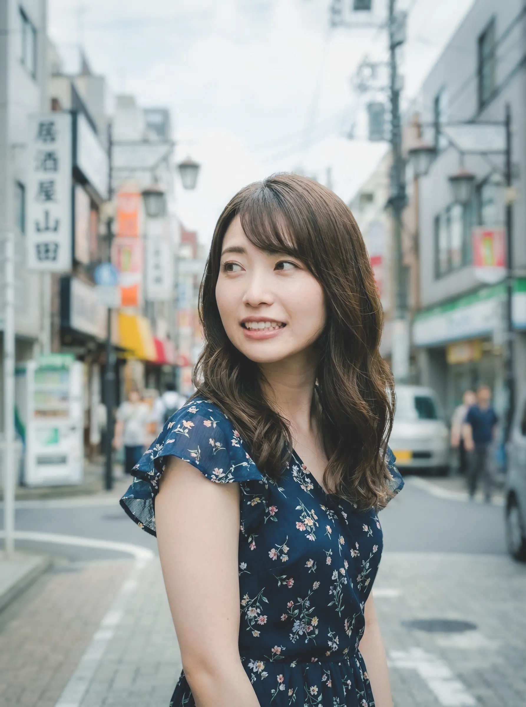
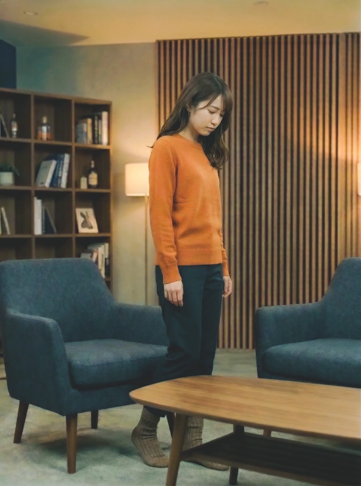

---
cssclasses:
  - image-400
tags:
  - "#ARG"
---
# 修正項目 チェックリスト
# ARG修正チェックリスト

## 最優先（真相・世界観の整合性）

- [ ] 鳴海を殺害した人物を統一する（推奨：堂島剛）
- [ ] 「玲奈が犯人」「玲奈が被害者」「玲奈が共犯」の表記を整理する
- [ ] 玲奈の最終役割を「被害者兼共犯者」に修正する
- [ ] 真相欄・登場人物欄・事件当日の流れで内容を統一する
- [ ] 遺体遺棄の実行者を明確化する（剛単独／玲奈協力）

---

## 地名・時系列修正

- [x] 「隣町の山」を統一する
- [x] 「宵見山」を統一する
- [x] 「宵見町山中」を統一する
- [ ] 撮影地・遺棄現場・発見現場が同一か別か整理する
- [ ] 宵見山の地理設定を追加する（隣町境界など）

- [x] YOIMI Cloud公開日（2016/04/20）を整理する
- [x] YOIMI Cloud本運用日（2016/09/05）を整理する
- [x] β版→正式運用へ変更するか決定する

- [x] 三崎死亡日（11/20）を再確認する
- [x] EDの「数ヶ月後」を修正する
- [x] 「数週間後」に変更するか判断する

---

## 写真・Exif・機材設定

- [ ] ASTRALがカメラかレンズか決定する
- [ ] Luminar側の定義を整理する
- [ ] Exif表記を統一する
- [ ] シリアル番号ルールを整理する

### 正規写真群

- [ ] 鳴海の正規写真フォルダを独立させる
- [ ] Portrait_1〜4を正規写真へ整理
- [ ] 鳴海＝Luminar固定設定を明記

### 事件写真群

- [ ] RAW写真群を独立させる
- [ ] 事件当日の自動同期写真を分離
- [ ] RAWの時刻設定を決定する

### 偽造写真群

- [ ] DSL_2410以降を偽造写真専用に変更
- [ ] 柴田クラウド内データを独立
- [ ] 偽造写真数を決定する
- [ ] 偽造写真の撮影時刻を追加する
- [ ] 玲奈シルエット発見条件を追加する

---

## 証拠・推理ロジック

- [ ] 「玲奈が映っている＝矛盾」になっている理由を明確化する
- [ ] 偽造写真が何を証明する目的か定義する
- [ ] 柴田単独犯説との矛盾点を整理する
- [ ] レンズシリアル一致を決定打にするか決める
- [ ] 反射物を決定打にするか決める
- [ ] Exifを決定打にするか決める
- [ ] 最終的な真相到達ルートを固定する

---

## 刈谷まわり

- [ ] 刈谷が有能なのにミスした理由を追加する
- [ ] 偽造データの穴を故意に残した設定を入れる
- [ ] 刈谷の保険行動を追加する
- [ ] 刈谷の思想メモを追加する
- [ ] 刈谷の裏目的を明文化する
- [ ] 最終スカウトメールへの伏線を追加する

---

## 堂島剛まわり

- [ ] 堂島がヨイミカメラを潰す理由を強化する
- [ ] 「玲奈を守る」だけでなく支配欲を追加する
- [ ] データセキュリティへの興味を伏線化する
- [ ] 三崎暗殺動機を整理する
- [ ] 堂島がプレイヤー監視している描写を追加する

---

## 柴田まわり

- [ ] 柴田の黙秘理由を強化する
- [ ] 顧客データ保護思想を追加する
- [ ] 警察非協力の理由を補強する
- [ ] 下書きメール内容を決定する
- [ ] 無実を示す人間描写を追加する

---

## パスワード・セキュリティ

- [ ] 強固な暗号化と簡単パスワードの矛盾を修正する
- [ ] バックドア設定を追加する
- [ ] 刈谷保守用アカウント設定を追加する
- [ ] Admin系ログイン方式を見直す
- [ ] 従業員ごとに突破方法を変える
- [ ] 総当たり感を減らす

---

## エンディング修正

### ED A

- [ ] 堂島へ報告ルート整理
- [ ] 技術的綻び修正描写追加
- [ ] 暗転演出調整
- [ ] 「迎えを送った」表現を安全寄りに変更
- [ ] インターホン動画採用可否決定

### ED B

- [ ] ニュース画面時系列調整
- [ ] 柴田再逮捕導線整理
- [ ] 三崎事故記事調整
- [ ] 刈谷スカウト導線整理

### 共通

- [ ] 「警察へ送る」が無い理由を追加
- [ ] 外部送信遮断設定を追加
- [ ] 証拠能力不足設定を追加するか決める
- [ ] 隠しED Cを作るか決める

---

## プレイヤー体験

- [ ] 一本道になりすぎていないか確認
- [ ] パスワード当てゲーム化していないか確認
- [ ] 写真解析パートを増やすか検討
- [ ] Exif確認演出を追加
- [ ] RAW現像演出を追加
- [ ] AIチャット通知タイミング調整
- [ ] 強制終了タイミング確認
- [ ] 未探索要素の通知条件確認

---

## 演出・伏線追加候補

- [ ] 刈谷の思想メモ追加
- [ ] 堂島の支配的発言追加
- [ ] 鳴海の執着描写追加
- [ ] 玲奈の精神悪化描写追加
- [ ] 星野の罪悪感描写追加
- [ ] 三崎の違和感メモ追加
- [ ] 柴田の誠実描写追加
- [ ] 最終監視演出追加
- [ ] プレイヤーが監視対象になる伏線追加
# ARGを作る
## URL
https://mokusaku.github.io/WebARG/

## **ARG基本要件**

- **プレイスタイル:** Webブラウザ完結型、スマートフォン対応。検索とクリックによる探索。
- **プレイ想定時間:** 約2時間。
- **コンセプト:** 後味の悪い結末（胸糞展開）を主軸とした、デジタルフォレンジック風ミステリー。

---

## **世界観・舞台設定**

- **時代設定:** 現代（2016年）。
- **舞台:** 宵見町（よいみちょう）。四方を山に囲まれ霧が多発する、撮影愛好家に人気の地方都市。
- **中心施設:** 「ヨイミカメラ」。プロ御用達の高機材レンタルと強固な暗号化クラウドを提供するカメラ店。現在は事件の影響で閉店状態。

---

## 時系列

### 【事前の伏線期】

- **2016.04.15:** 季刊誌「YOIMI Vision」春号発行。星野悠による鳴海朔のインタビュー記事（Luminar 85mmへの異常な愛着と、現場にはそれ一本しか持ち込まないという事実）が掲載される。
- **2016.08.12:** 【店長日記1】堂島剛（真黒幕）からの多額の機材寄贈と、娘・玲奈のテスト撮影に関する記述。堂島が店の「データセキュリティ構造」に強い関心を示していたことが記録される。
- **2016.09.05:** 【店長日記2】刈谷（裏切り者）の主導により、警察の令状でも突破困難な「顧客保護用の強固な暗号化クラウド」の運用が開始される。
- **2016.10.12:** 【店長日記3】鳴海が「宵見山（後の遺棄現場）」での撮影計画を語る。三崎が鳴海の機材を念入りに点検し、山の足場の悪さを心配する描写が記録される。

### 【事件発生と隠蔽工作】

### 事件当日の論理的シークエンス（2016.10.26）

1. **偽りの約束:** 玲奈は「今日の撮影は、鳴海先生ではなく弟子の星野が担当する」と聞かされており、それならばと撮影を承諾した。
2. **不測の事態（鳴海の出現）:** 現場である宵見山に現れたのは、鳴海本人であった。鳴海は「最後くらいは私が撮りたい」と芸術家としての情熱を盾に強行。玲奈は拒絶できず、星野を含めた3名での撮影が開始される。
3. **作為的な孤立:** 日没前、鳴海は星野に対し「重いストロボ機材は先にヨイミカメラへ運んでおけ。私は玲奈さんと最後に少しだけ、自然光で撮りたい」と命じ、星野を現場から排除。星野は師匠の指示に従い、帰路に着く（これが後に、星野が「自分が先に帰らなければ」と自責の念に駆られる理由となる）。
4. **犯行の実行:** 二人きりになった鳴海が玲奈を襲う。しかし、玲奈から事前に「何かあったら助けて」と相談され、密かに追尾していた堂島剛が介入。剛は激昂の末、鳴海を殺害。
5. **カメラの持ち去りと捏造:** 剛は証拠となる鳴海のカメラ（Luminar装着）をその場から持ち去り、破壊または隠匿。
6. **柴田店長への転嫁:** 剛は娘を守るため、かつ娘が怯えていた「ヨイミカメラ」という環境を抹殺することを決意。買収した刈谷を使い、サーバー内の正規データを削除。柴田を犯人に仕立てるための「偽造データ（ASTRAL撮影）」をバックドアから流し込む。

### 【ARGの舞台設定期（現在）】

- **2016.10.31:** ヨイミカメラのHPトップに「臨時休業のお知らせ」が掲載される。この更新を最後に、刈谷は姿を消す。
- **2016.11.15（プレイヤー介入日）:** 堂島剛からプレイヤー（外部の優秀な調査員）宛に、「友人である柴田の無実を証明するため、警察が開けられなかった裏データを抽出してほしい」という偽りの依頼が届く。
- **同日:** プレイヤーがヨイミカメラのHPにアクセスし、調査（ゲーム）を開始する。

---

## **登場人物と役割**

- **堂島 剛（どうじま ごう） 52歳:** 依頼主。玲奈の父親で資産家。プレイヤーを調査員として雇った真の黒幕。
    
    娘の玲奈が鳴海に関係を迫られていて怖いと相談を受けていた。10/26に宵見山で撮影があることを娘経由で知る。念の為つけていたところ、娘が鳴海に迫られている現場を目撃。
    
    激昂し、鳴海を殺害。その後、娘と共に遺棄。
    
    刈谷を1億5000万円で買収し、犯人をヨイミカメラの店長である柴田へ差し向けるべく、ヨイミカメラのHPの改ざんをさせる。


- **堂島 玲奈（どうじま れな） 22歳:** 犯人であり、被害者。剛の娘で被写体モデル。2016年4月にヨイミカメラ入社。鳴海 朔に執拗に関係を迫られ、心身の不調をきたし、同年9月に退社。退社後もモデルとして同社に協力。
    
    10/26の宵見山での撮影は星野 悠が担当すると聞かされていたが、鳴海も現れた。
    
    居合わせた父の剛が鳴海を殺害後、遺棄するのを手伝った。
    

    
- **柴田 健吾（しばた けんご）50歳:** ヨイミカメラ店主。顧客データ保護のため黙秘を貫き、警察に拘束中。濡れ衣を着せられた人物。
    

    
- **鳴海 朔（なるみ さく）45歳:** 被害者。行方不明となっている完璧主義のポートレート写真家。
    
    ヨイミカメラとは契約を結んでおり、度々足を運んでいた。
    
    堂島 玲奈を好きになり、執着するようになる。
    

    
- **星野 悠（ほしの ゆう）24歳:** 鳴海の弟子。ヨイミカメラの社員。彼のブログに記された鳴海の「愛用機材の癖」が、偽造データを見破る鍵となる。
    

    
- **刈谷 哲（かりや てつ）29歳:** ヨイミカメラのWeb・サーバー担当。剛に買収されてバックドアと偽造データを仕込んだ裏切り者。事件以降、失踪。
    

    
- **三崎 愛観（みさき まなみ）26歳:** 機材メンテ担当。店主の無実を信じ、SNSで情報収集を行う人物。鳴海が当日持ち出した機材リストを把握している。
    
    11/20に不慮の事故で亡くなる。事故の犯人は堂島 剛である。
    

    

---

## **事件の真相とギミック（データの穴）**

- **堂島玲奈：**被害者であり、共犯者。鳴海から執拗に関係を迫られていたが、父・剛が鳴海を殺害した後、恐怖と依存から遺体遺棄に加担した。
- **依頼の真の目的:** 剛自身が偽造証拠を「発見」すると警察に自作自演を疑われるため、優秀な外部調査員（プレイヤー）を誘導し、非公式にバックドアを開けさせて柴田の有罪を確定させる証拠を「暴露」させることが目的。
- **突破口（プレイヤーの勝機）:** 偽造された現場写真のExifデータには最新機種『ASTRAL』と記録されていますが、星野のブログから鳴海が旧型マニュアルレンズ『Luminar』しか使わないことが判明します。また、画像の色調（コントラスト）を極端に補正すると、現場の反射物に事件現場にいるはずのない玲奈のシルエットが浮かび上がる。

---

## **エンディング分岐（プレイヤーの選択）**

- **ルートA（真相を剛に提出する）:** プレイヤーが偽造の矛盾点（データの穴）を剛に報告した結果、剛は自身の計画の「技術的な綻び」を完璧に修正することが可能になります。サイトへのアクセスが強制的に遮断され、画面が暗転。剛から「調査完了への感謝と、特別報酬を直接手渡しするため玄関先に迎えをやった」という旨のメール風テキストが表示され、プレイヤーの暗殺（口封じ）を暗示して終了。

展開：事件の全容と偽造データの矛盾点（証拠）をまとめた報告フォームを送信後、サイトの挙動が停止。画面が強制的に暗転し、一通の「メール」風テキストのみが画面中央に浮かび上がります。

> **件名：調査報酬の受け渡しについて差出人：堂島 剛**
> 
> 
> 見事な調査能力だ。警察のサイバー担当より遥かに優秀であると認めよう。
> 君のおかげで、私が構築したシナリオの『技術的な綻び』を完全に把握することができた。これで心置きなくデータを修正し、柴田の有罪を確定させることができる。
> 
> さて、君への特別報酬だが、振り込みではなく直接手渡しで行う手筈を整えさせてもらった。
> 今、君の部屋の玄関先に迎えの者を向かわせている。
> 決して外部へ連絡などしようとせず、素直にドアを開けてくれたまえ。
> 
> ──それでは、さようなら。
> 

演出：このテキストが表示された数秒後、JavaScript等でブラウザのタブを強制的に閉じる、あるいは真っ黒な画面に「Connection Lost」とだけ表示させる処理を実行することで、プレイヤーに「現実への干渉」を錯覚させ、メタ的な恐怖を煽ることが可能と推測されます。

堂島 剛目線の動画を作り、プレイヤーの家のインターホンを押す動画を流す？

- **ルートB（真相を提出せず傍観する）:**
- **沈黙と代替案の実行:** プレイヤーから想定期間内に報告がない、あるいは調査を放棄されたと判断した堂島は、直ちにプランBに移行します。別の（優秀ではないが従順な）調査員を雇い、意図的に用意されたバックドアを通らせて偽造データを「発見」させ、マスコミや警察にリークさせます。
- **専門知識の欠如による盲信:** 世間や警察には、鳴海の「旧型レンズ（Luminar）へのこだわり」や、微細な「ストロボの反射の矛盾」を見抜く写真・機材に対する専門知識がありませんでした。結果として、データの穴は見逃され、偽造写真が決定的な証拠として採用されます。
- **結末の確定:** 偽造データにより柴田の有罪が確定し、証拠の不自然さに気づく可能性があった三崎愛観は、口封じのため不慮の事故を装って暗殺されます（推測です）。
- **刈谷からのメール（カタルシス）:** 全てが終わった後、サーバーのアクセスログで「プレイヤーが真実に到達しながらもあえて沈黙した」ことを知っていた刈谷から、その冷徹な判断力と自己保身能力を高く評価するスカウトメールが届き、物語は終了します。

展開：報告フォームを破棄する、あるいは一定時間が経過すると、画面が暗転し「数週間後」の架空のニュースサイトのポータル画面へ遷移します。マスターが提示した事実が、無機質なニュース記事のトピックスとして羅列されます。

- **【社会】宵見山の隣町側斜面にて、行方不明の写真家・鳴海朔氏の遺体を発見**
- **【裁判】ヨイミカメラ店主・柴田健吾被告、証拠隠滅および死体遺棄の容疑で再逮捕。本人は依然として容疑を否認**
- **【地域】ヨイミカメラ元従業員・三崎愛観さん、交差点で大型トラックと衝突し死亡。警察は不慮の事故として処理**

記事を読み進めようとスクロールした直後、画面上に未承諾のダイレクトメッセージが強制的に割り込んできます。差出人は裏切り者の店員、刈谷哲です。

> **件名：新規事業立ち上げに伴うスカウトの件差出人：株式会社アストラル・デザイン 代表取締役 刈谷 哲**
> 
> 
> 久しぶり。サーバーのアクセスログ、見させてもらったよ。
> あの裏の暗号化フォルダまで辿り着いておきながら、あえて堂島には報告しなかったんだね。
> 賢明な判断だ。正義感や好奇心なんてものを振りかざせば、三崎みたいに「不運な事故」に巻き込まれるのがオチだからね。
> 
> 君のその、Webの深層構造を見抜き、ソースコードの違和感を解析する能力は本物だ。
> 実は今、新しくWeb制作会社を立ち上げてね。大手の案件も多数請け負っているんだが、君のような優秀なエンジニアを探している。
> どうかな。泥舟と一緒に沈んだ店長のことは忘れて、うちの会社に来ないか？
> 
> 良い返事を待っているよ。
> 

# 写真のExif


Date: 2016/04/18

Model: LUMINAR9S2

Lens: LUMINAR85F14F

Aperture: 2.0

ISO: 100

Shutter Speed: 1/250

Copyright: Narumi Saku



Date: 2016/08/07

Model: LUMINAR9S2

Lens: LUMINAR85F14F

Aperture: 1.4

ISO: 100

Shutter Speed: 1/800

Copyright: Narumi Saku



Date: 2016/09/01

Model: LUMINAR9S2

Lens: LUMINAR85F14F

Aperture: 2.0

ISO: 640

Shutter Speed: 1/150

Copyright: Narumi Saku


Date: 2016/10/26

Model: LUMINAR9S2

Lens: LUMINAR85F14F

Aperture: 1.4

ISO: 100

Shutter Speed: 1/800

Copyright: Narumi Saku


Date: 2016/10/26

Model: LUMINAR9S2

Lens: LUMINAR85F14F

Aperture: 5.6

ISO: 640

Shutter Speed: 1/800

Copyright: Narumi Saku


Date: 2016/10/26

Model: LUMINAR9S2

Lens: LUMINAR85F14F

Aperture: 5.6

ISO: 640

Shutter Speed: 1/800

Copyright: Narumi Saku


Date: 2016/10/26

Model: LUMINAR9S2

Lens: LUMINAR85F14F

Aperture: 11

ISO: 100

Shutter Speed: 1/150

Copyright: Narumi Saku

# Webページ構成(攻略チャート)

TOPページから店長日記へ飛ぶ
店長日記から「Luminar 85mm」というキーワード。
**Luminar 85mm**と検索する。
検索結果から「光の粒子を、掌に。――写真家・鳴海朔が語る『Luminar 85mm』の呪縛と真理」をクリック。

記事公開日は2016年 4月24日、鳴海の誕生日は星野の「先月の6日、お誕生日でしたよね。」という言葉から逆算して、3月6日。

STAFFページの鳴海の誕生日を見る。1971.03.06。

ログイン画面で**IDにLuminar85、パスワードに19710306**を入力。

鳴海朔のクラウドデータベースにアクセス可能に。

残された4枚の写真は全て鳴海が撮影した堂島 玲奈の写真。
日付を追うごとに彼女から笑顔が消えている。

4枚目は10/26の撮影の自動アップロードなのでRAWファイルになっている。

鳴海のクラウドデータベースから「sync_error_log.text」をクリック。
エラーログから、刈谷の従業員管理ページへ進むためのパスワードを発見する。

**パスワードはAdmin_Kariya**

次に、IDまたはメールアドレスを見つける必要がある。

ABOUTの連絡先を見る。yoimicamera_shibata@yoimi.co.jp とある。

メールアドレスのshibataをkariyaと変えて、それを刈谷のIDとする。

**ID：yoimicamera_kariya@yoimi.co.jp
パスワード： Admin_Kariya**

これを応用して、全ての従業員専用メールボックスにアクセスできるようになる。

- 柴田 健吾
    
    **ID：yoimicamera_shibata@yoimi.co.jp
    パスワード： Admin_Shibata**
    
- 刈谷 哲
    
    **ID：yoimicamera_kariya@yoimi.co.jp
    パスワード： Admin_Kariya**
    
- 三崎 愛観
    
    **ID：yoimicamera_misaki@yoimi.co.jp
    パスワード： Admin_Misaki**
    
- 星野 悠
    
    **ID：yoimicamera_hoshino@yoimi.co.jp
    パスワード： Admin_Hoshino**
    

## 柴田 健吾のメールボックスから分かること

- 鳴海 朔に10/26の撮影に参加することを許可している
- YOIMI Cloudというクラウドデータベースの存在
- 三崎のメンテナンス台帳の存在とそのパスワード
- 宵見県警から、鳴海 朔失踪事件に関しての捜査協力要請がかかっている
    - 刈谷の諭す通り、柴田は宵見県警の協力要請には応じていない
- 刈谷から、宵見県警には屈するなという内容のメール
- 柴田は朝から用事があり、10/26の山岳撮影には参加できない。店にもいない
- 下書きに、従業員に一斉送信しようとしたメールが送られずに残されている
- 宵見新聞社からの取材メールが届いているが、柴田は返信せずにゴミ箱に入れた

## 刈谷 哲のメールボックスから分かること

- 三崎から第2保管庫の湿度上昇のメールが来ており、すぐに対応している
- YOIMI Cloudからの自動システム通知が届いている
    - 刈谷は管理者権限を持っているため、このメールからはパスワード不要で鳴海のデータベースにアクセスできる
- 柴田に対して、警察に応じないよう諭すメールを送信している
- ゴミ箱に堂島 剛からのメールが入れられている
    - 賄賂を渡され、堂島剛の指示があればYOIMI Cloudのコードを好きに書き直すと言った内容

## 三崎 愛観のメールボックスから分かること

- 刈谷へ第2保管庫の湿度上昇を懸念するメールを送信している
- 柴田へ機材メンテナンスの報告をしている

## 星野 悠のメールボックスから分かること

- 鳴海から10/26の撮影に同行する旨のメールが届いている
    - 弟子である星野はその提案を返信にて快諾
- 鳴海宛に一人で撮影ができるかどうか不安であることを吐露している
- 鳴海とは良好な師弟関係を築いている
    - 再掲記事とコーヒーの件から
- 10/26撮影後、鳴海が戻らないことを心配し、メールを複数送っている

三崎or柴田のメールボックスから、三崎の管理台帳にアクセスできる。

管理台帳のパスワードは同メールの一番下に書いてある。
管理台帳のパスワードは「riantdoraeeruaitkr」

メンテナンス台帳から、鳴海、星野、堂島 玲奈の名前を発見できる。(全て返却済)

ここから、彼らのレンズの個体識別番号をメモしておく。

- 堂島 玲奈
    - AS-8514-9999(ASTRAL 85mm F1.4 Prime mkII)
- 鳴海 朔
    - LU-8514-0001(Luminar 85mm F1.4)
- 星野 悠
    - MU-2870-1122(MUSEO 28-70mm F2.8)
    - AS-7020-5500(ASTRAL 70-200mm F2.8 Pro Zoom)

検索窓に「YOIMI Cloud」を打つ。

「写真表現の「聖域」を守る。プロフォトグラファー専用暗号化ストレージ「YOIMI Cloud β版」提供開始のお知らせ**」**というページがヒットする。

タイトルの上の管理番号、「YM-MST-2016-0420」をメモ。

2016は2016年。0420は4月20日を意味する。

この日付を事件があった「1026」と書き換えて検索。「YM-MST-2016-1026」。

刈谷のメモがヒットする。

メモから、柴田のクラウドのIDが「Manager_Private」、パスワードが「柴田の名前+誕生日」ということが分かる。

よってパスワードは「ShibataKengo1216」。

更に、**刈谷が柴田のクラウドを捏造したことが判明。**

**ID：Manager_Private**

**パスワード：ShibataKengo1216**

をログイン画面に入力。

柴田のクラウドデータベースが開く。

写真が3枚あり、**DSL_2410.pngに人の手が写っていることがわかる。**

写真のExifを見ると、シリアルナンバーが「**AS-8514-9**999」であることが分かる。

これは、三崎のメンテナンス台帳より、堂島 玲奈のレンズを使用して撮影されていたことが分かる。

写真は全体的に緑がかっていたり、構図がぐちゃぐちゃだったり、ブレたりしており、少なくともプロの写真家が撮ったものではないことが分かる。Exifも素人が撮影したような数値になっている。

これらの情報から、鳴海ではなく、別の誰かが撮影したことが分かる。

これまでの情報から、堂島剛が関わっている可能性が高くなる。(刈谷を買収していたり、意味深なメールを送っていたり)

memo_201610260115を開く。

柴田が鳴海を殺害した旨の内容が書かれている。

刈谷のメモより、捏造したものであると予想できる。

---

実装メモ

AIChatbotを右下に常に表示させておき、柴田のクラウドのメモに到達した1分後にボットから通知が来るようにする。

その際、それまでプレイヤーが到達したページ数をカウントし、表示。

まだ見ていない箇所が有る、無いに関わらずゲーム終了するかを選択できるようにする。

堂島に真実を送るか否か、また調査を続けるかの3択をプレイヤーに提示。

送る→ED：A　送らない→ED：B　調査続行→キャンセル

調査続行を選択した場合、以後ボットからいつでも調査結果を送るか送らないかの2択を選択できるようにしておき、プレイヤーの任意のタイミングで選べるようにする。

EDのAとBの名前を決める。

# 修正案 2026-05-27
#ChatGPT 
結論として、**骨格はかなり使えます**。  
「依頼主が黒幕」「プレイヤーが真相に近づくほど利用される」「証拠の技術的矛盾から逆算する」というARG向きの構造は成立しています。

ただし、現状のまま実装すると、**真相部分・写真データ・クラウド設定・時系列にいくつか矛盾があります**。  
特に直すべきなのは、**鳴海を殺したのが誰なのか**、**偽造写真のExifが何を示すのか**、**強固な暗号化クラウドなのにパスワードが単純すぎる点**です。

---

# 全体評価

## 良い点

### 1. ARGとしての導線は分かりやすいです

プレイヤーの進行はかなり整理されています。

> TOP  
> 店長日記  
> Luminar 85mm検索  
> 鳴海クラウド  
> sync_error_log  
> 刈谷管理画面  
> 従業員メール  
> 三崎メンテナンス台帳  
> 柴田クラウド  
> 偽造証拠の矛盾発見  
> エンディング分岐

この流れは、**探索型ARGとして自然**です。  
Web完結型で、検索・クリック・ログイン・Exif確認を使う構成とも相性が良いです。

### 2. 写真・レンズ・Exifを使った謎解きはテーマに合っています

カメラ店、写真家、レンズへの執着、Exif、メンテナンス台帳。  
これらが全部「写真を扱うARG」として繋がっています。

特に、鳴海が **Luminar 85mmしか使わない** という設定を先に提示しておき、後半で **ASTRAL系のExifやシリアル番号** が出てくる構成は良いです。

### 3. 後味の悪い結末もコンセプトに合っています

どちらのエンディングでも救われない構造は、胸糞展開として成立しています。

- 堂島に報告する  
    → 利用され、口封じされる暗示
    
- 報告しない  
    → 柴田が有罪化し、三崎も殺され、刈谷に評価される
    

この二択は、「正義感を出しても沈黙しても嫌な結果になる」という後味の悪さがあります。

---

# 重大な矛盾点と改善案

## 1. 鳴海を殺した人物が矛盾しています

|項目|現在の記述|問題点|
|---|---|---|
|事件当日の流れ|堂島剛が激昂して鳴海を殺害||
|登場人物欄|玲奈は「犯人であり、被害者」||
|真相欄|玲奈が鳴海を殺害し、父の剛と共謀||

ここは最重要です。  
**誰が直接殺したのか**が揺れています。

## 改善案

どちらかに固定してください。

### 案A：堂島剛が殺害、玲奈は死体遺棄の共犯

こちらを推奨します。

理由は、現在の時系列と一番相性が良いからです。

修正文：

> 真相：堂島剛が鳴海を殺害し、玲奈は父と共に遺体の遺棄・証拠隠滅に加担した。玲奈は鳴海による執着の被害者である一方、事件後は共犯者となる。

この場合、玲奈の説明はこう直すと自然です。

> 堂島玲奈：被害者であり、共犯者。鳴海から執拗に関係を迫られていたが、父・剛が鳴海を殺害した後、恐怖と依存から遺体遺棄に加担した。

この方が、玲奈の悲劇性が残ります。  
「被害者なのに、最後は加害側に回ってしまう」という後味の悪さも強くなります。

---

## 2. 「隣町の山」「宵見山」「宵見町山中」が混在しています

|表記|出てくる場所|
|---|---|
|隣町の山|店長日記3、事件当日|
|宵見山|10/26撮影の説明|
|宵見町山中|ルートBのニュース|

これはプレイヤーが混乱します。

## 改善案

地名を1つに統一してください。

### 推奨設定

> 宵見町の外れにある山域「宵見山」。行政上は隣町との境界にまたがっている。

これなら全部回収できます。

修正例：

> 鳴海が「宵見山の隣町側斜面」での撮影計画を語る。  
> 後にその一帯が遺棄現場となる。

ニュース表記もこうします。

> 【社会】宵見山の隣町側斜面にて、行方不明の写真家・鳴海朔氏の遺体を発見

---

## 3. YOIMI Cloudの開始時期が矛盾気味です

|記述|内容|
|---|---|
|2016.09.05|刈谷主導で強固な暗号化クラウドの運用開始|
|攻略チャート|「YOIMI Cloud提供開始のお知らせ」管理番号が2016-0420|

4月20日に提供開始しているのに、9月5日に運用開始という形になっています。

## 改善案

役割を分ければ解決します。

### 修正案

- **2016.04.20**  
    YOIMI Cloudのベータ版・告知ページ公開
    
- **2016.09.05**  
    刈谷が暗号化・権限管理・バックドアを含む本運用版へ移行
    

こうすれば、4月の管理番号と9月の店長日記が両立します。

---

## 4. 「強固な暗号化クラウド」なのに、パスワードが単純すぎます

現在は、

- Admin_Kariya
    
- Admin_Shibata
    
- Admin_Misaki
    
- Admin_Hoshino
    
- ShibataKengo1216
    

というかなり単純なパスワードです。

これはARGの攻略上は分かりやすいですが、物語設定上の「警察の令状でも突破困難な強固な暗号化クラウド」と矛盾します。

## 改善案

**暗号化は強いが、認証情報とバックドアが脆い**という設定に変えてください。

修正文：

> YOIMI Cloudの保存データ自体は強固に暗号化されている。しかし、刈谷が保守用バックドアと従業員用の簡易認証ルールを残していたため、内部情報を辿ったプレイヤーだけが侵入できる。

つまり、

- 暗号化そのものは強い
    
- でも刈谷が裏口を作っていた
    
- プレイヤーは暗号を破ったのではなく、内部導線を辿った
    

という整理です。

これはかなり重要です。  
「強固なセキュリティ」と「ARGとして解ける謎」を両立できます。

---

## 5. 写真枚数とファイルの役割が混乱しています

現在、計画書には以下が混在しています。

- 鳴海クラウドの「残された4枚の写真」
    
- Exif一覧にある Portrait_1〜Portrait_7
    
- 柴田クラウドにある3枚の写真
    
- DSL_2410.png
    
- 偽造データのASTRAL撮影写真
    

このままだと、プレイヤー側も制作者側も混乱します。

## 改善案

写真を3系統に分けてください。

|系統|ファイル名例|役割|
|---|---|---|
|鳴海の正規写真|Portrait_1〜Portrait_4|鳴海の作風・Luminar使用の証明|
|事件当日の自動同期写真|RAW_1026_01〜RAW_1026_03|玲奈の表情変化、最後の撮影痕跡|
|柴田クラウド内の偽造写真|DSL_2410〜DSL_2412|柴田を犯人に見せるための捏造証拠|

特に、偽造写真は **Portrait** ではなく、別名にした方がいいです。

例：

```text
Narumi_Archive/
- Portrait_20160418.webp
- Portrait_20160807.webp
- Portrait_20160901.webp
- RAW_20161026_1832.dng

Manager_Private/
- DSL_2410.png
- DSL_2411.png
- DSL_2412.png
- memo_201610260115.txt
```

これで、正規写真と偽造写真が分かれます。

---

## 6. ASTRALが「カメラ」なのか「レンズ」なのか曖昧です

現在の記述では、

> 最新機種『ASTRAL』  
> ASTRAL 85mm F1.4 Prime mkII  
> AS-8514-9999

となっています。

しかしExif上では、ASTRALがカメラなのかレンズなのか分かりにくいです。

## 改善案

ASTRALを**レンズブランド／レンズ名**として固定すると良いです。

例：

> ASTRAL 85mm F1.4 Prime MkIIは、玲奈がレンタルしていた最新AFレンズ。  
> 鳴海が愛用するLuminar 85mm F1.4とは別系統のレンズである。

Exifもこう分けると分かりやすいです。

```text
Camera Model: LUMINAR9S2
Lens Model: ASTRAL 85mm F1.4 Prime MkII
Lens Serial: AS-8514-9999
```

鳴海の正規写真はこうです。

```text
Camera Model: LUMINAR9S2
Lens Model: LUMINAR 85mm F1.4
Lens Serial: LU-8514-0001
```

この差分が明確な証拠になります。

---

## 7. 「ASTRAL 70-200mm F2.8 Prime」は名称が不自然です

70-200mmはズームレンズなので、通常は **Prime** とは呼びません。  
Primeは単焦点レンズの意味です。

## 改善案

以下のように直してください。

```text
AS-7020-5500
ASTRAL 70-200mm F2.8 Tele Zoom
```

または、

```text
ASTRAL 70-200mm F2.8 Pro Zoom
```

細かいですが、写真・カメラ系ARGではこういう部分が目立ちます。  
カメラ好きのプレイヤーほど違和感を覚えます。

---

## 8. 「玲奈のシルエットが事件現場にいるはずがない」が弱いです

計画書では、反射物に玲奈のシルエットが浮かび上がることが証拠になっています。

ただし、事件当日の撮影には玲奈が参加しています。  
そのため、単に「現場に玲奈がいる」だけでは矛盾になりません。

## 改善案

「いるはずがない理由」を明確にしてください。

例えば、偽造写真の設定をこうします。

> 偽造写真は、鳴海殺害後に柴田が単独で遺棄現場を撮影した証拠として配置されている。  
> しかし、反射物には玲奈の姿が映っており、少なくともその写真の撮影時に玲奈が現場にいたことが分かる。

これなら強いです。

さらに強くするなら、時刻を使います。

```text
偽造写真のExif時刻：2016/10/26 23:41
玲奈の公式証言：20:10には帰宅していた
反射：23時台の写真に玲奈らしき人物が映っている
```

これで矛盾が明確になります。

---

## 9. 刈谷が有能なのに、偽造データのミスが雑に見えます

刈谷はWeb・サーバー担当で、堂島に買収され、YOIMI Cloudのコードを書き換えられる人物です。  
それほど有能なら、Exifのレンズシリアルや反射の矛盾を残すのは少し不自然です。

## 改善案

これは**刈谷がわざと残した保険**にした方が良いです。

修正案：

> 刈谷は堂島に買収されたが、完全には信用していなかった。  
> そのため、偽造データ内に玲奈のレンズシリアルと反射痕跡をあえて残し、堂島に切られた時の保険にしていた。

こうすると、ルートBの刈谷メールとも繋がります。

刈谷は単なる裏切り者ではなく、

- 堂島を利用している
    
- 柴田を売った
    
- プレイヤーの能力も見ている
    
- 自分の安全確保のために証拠を残していた
    

という、かなり嫌な人物になります。

これは胸糞感を強められます。

---

## 10. 三崎の死亡日と「数ヶ月後」が合っていません

三崎は **11/20に死亡** とあります。  
プレイヤー介入日は **11/15** です。

つまり、三崎の死亡は5日後です。

しかしルートBでは「数ヶ月後」のニュース画面へ遷移するとあります。  
この場合、時間感覚がややズレます。

## 改善案

どちらかに寄せてください。

### 案A：数週間後にする

```text
数週間後
```

こちらが自然です。

### 案B：三崎の死亡日を遅らせる

```text
2016.12.20
三崎愛観、交通事故により死亡
```

ただし、三崎が証拠に気づく危険性があるなら、堂島は早めに消すはずです。  
そのため、個人的には **「数週間後」表記に修正** が良いです。

---

# 伏線整理

## 現在の伏線と回収

|伏線|初出|回収|
|---|---|---|
|鳴海はLuminar 85mmに異常な愛着がある|YOIMI Vision記事、星野ブログ|偽造写真のASTRAL Exifと矛盾|
|鳴海は現場に一本しか持ち込まない|インタビュー記事|別レンズ使用の不自然さを示す|
|堂島がデータセキュリティに関心|店長日記1|刈谷買収・サーバー改ざんの前振り|
|刈谷主導で暗号化クラウド開始|店長日記2|バックドアと偽造データ配置に繋がる|
|三崎が機材を念入りに点検|店長日記3、メンテ台帳|レンズ個体識別番号の証拠|
|星野が先に帰らされる|事件当日の流れ|星野の自責、現場不在の理由|
|柴田が警察に協力しない|柴田メール|濡れ衣が晴れない理由|
|刈谷が警察協力を止める|刈谷メール|刈谷の裏切りの示唆|
|玲奈の笑顔が日付ごとに消える|鳴海クラウド写真|鳴海への恐怖・被害の示唆|
|玲奈のASTRALレンズシリアル|三崎台帳|偽造写真の撮影者／関与者の証拠|
|反射物に映る玲奈|偽造写真の補正|柴田単独犯説の崩壊|
|堂島から刈谷へのメール|刈谷ゴミ箱|買収と改ざんの証拠|

伏線の量は十分です。  
問題は、**どの伏線が決定打なのか**をもう少し整理した方が良いことです。

---

# 推奨する真相構造

現状を整理すると、こうした方が一番綺麗です。

## 実際の事件

1. 鳴海は玲奈に執着していた。
    
2. 玲奈は「星野が撮影担当」と聞かされていたため、10/26の撮影を承諾した。
    
3. しかし現場に鳴海本人が現れる。
    
4. 鳴海は星野を機材運搬名目で帰らせる。
    
5. 鳴海が玲奈に迫る。
    
6. 玲奈を心配して尾行していた堂島剛が介入。
    
7. 剛が鳴海を殺害。
    
8. 玲奈は恐怖と父への依存から、遺体遺棄に加担。
    
9. 剛はヨイミカメラそのものを憎み、柴田に罪を被せる計画を立てる。
    
10. 剛は刈谷を買収。
    
11. 刈谷は柴田のクラウドに偽造データを配置。
    
12. ただし刈谷は保険として、玲奈のレンズシリアルや反射痕跡を残す。
    
13. プレイヤーはそれを見抜く。
    
14. しかし報告先を誤ると、堂島に利用される。
    

この構造が一番強いです。

---

# 攻略導線の改善案

## 現在の導線

現在の導線は成立していますが、少し「パスワード当て」が多いです。

特に、

```text
Admin_Kariya
Admin_Shibata
Admin_Misaki
Admin_Hoshino
```

は、1つ分かると全部芋づる式です。  
ゲームとしては便利ですが、やや単調です。

## 改善案

従業員ごとに突破方法を少し変えると良いです。

|対象|現在|改善案|
|---|---|---|
|鳴海クラウド|Luminar85 + 誕生日|そのままで良い|
|刈谷管理画面|sync_error_logからAdmin_Kariya|そのままで良い|
|柴田メール|Admin_Shibata|刈谷メール内の一文から推測|
|三崎メール|Admin_Misaki|第2保管庫メールの署名や台帳名から推測|
|星野メール|Admin_Hoshino|鳴海とのメール返信ヘッダから推測|

全部を同じルールにすると、途中から作業になります。  
プレイ時間2時間なら、**単純さは必要ですが、単調さは避けた方がいい**です。

---

# エンディング分岐の改善案

## 現状の問題

現状は、

- 堂島に送る
    
- 送らない
    
- 調査続行
    

です。

ただし、プレイヤーは自然にこう思います。

> 警察か三崎か世間に送ればいいのでは？

この選択肢がないと、「なぜそれができないのか」が気になります。

## 改善案

### 方法1：選択肢は2つのまま、外部送信できない理由を作る

例：

> 外部送信用フォームは存在するが、送信時に通信エラーになる。  
> ログを見ると、堂島側の監視スクリプトが外部送信を遮断していることが分かる。

または、

> プレイヤーが入手したデータは不正アクセスで得たものであり、そのまま提出すると証拠能力が弱い。  
> そのため、堂島への報告フォームだけが「正規の提出先」として残されている。

### 方法2：隠しルートCを作る

胸糞展開を維持するなら、ルートCも救済にしなくていいです。

例：

## ルートC：三崎へ送る

- プレイヤーは三崎へ証拠を送る。
    
- 三崎は真相に気づく。
    
- しかし11/20、三崎は事故死。
    
- 数日後、プレイヤーに三崎から予約送信メールが届く。
    
- そこには「私は間に合わなかった。でも、あなたはまだ見ているはず」と書かれている。
    
- 画面には、堂島側のアクセスログが表示される。
    
- プレイヤーも監視対象になっていることが分かって終了。
    

これなら、少しカタルシスを出しつつ、結局救われない構造にできます。

---

# 実装上の注意点

## 1. ブラウザのタブ強制終了は基本的に期待しない方が良いです

JavaScriptで任意のタブを強制的に閉じるのは、通常のブラウザ制約で難しいです。  
特に、ユーザーが直接開いたタブは `window.close()` では閉じられない場合が多いです。

そのため、演出は以下が現実的です。

```text
画面暗転
Connection Lost
入力不能
戻るボタンを押しても黒画面
数秒後にメール風テキスト表示
```

これで十分怖いです。

## 2. 「玄関先に迎えをやった」は扱いに注意

ARGとしては良い演出ですが、実際のプレイヤー住所を知っているように見せすぎると危険です。  
実在個人への脅迫に見えないよう、少し抽象化した方が安全です。

例：

> 君の端末情報は把握している。  
> こちらから迎えを向かわせる必要があるかどうか、すぐに分かるだろう。

または、

> 玄関のチャイムが鳴っても、驚かないでくれ。

このくらいの暗示で十分です。  
実写インターホン動画を使う場合も、**汎用的な廊下・玄関映像**にしてください。実在の住所や個人情報に寄せる必要はありません。

---

# 追加した方が良い伏線

## 1. 刈谷の「保険」伏線

後半で刈谷がスカウトメールを送るなら、前半から彼の思想を少し出した方が良いです。

例：

> セキュリティ担当者は、誰も信用しないくらいでちょうどいい。

または、

> 俺は誰かの正義より、ログの方を信用する。

これを刈谷のメモやメール署名に混ぜると、後半のキャラが立ちます。

## 2. 堂島の支配欲

堂島はただの父親ではなく、娘を守る名目で全てを支配しようとする人物にした方が怖いです。

例：

> 玲奈に悪影響を与える環境は、すべて取り除く必要がある。

この一文が店長日記や寄贈メールにあると、後半のヨイミカメラ潰しに説得力が出ます。

## 3. 柴田の黙秘理由

柴田が黙秘する理由を強くしてください。

例：

> 柴田は顧客の未公開作品、契約前の商業写真、個人モデルのセンシティブな撮影データを預かっていた。  
> そのため、警察への全面開示を拒んだ。

これなら、柴田が馬鹿正直に黙っているのではなく、職業倫理で追い詰められている人物になります。

---

# 優先修正リスト

実装前に、最低限ここは直した方が良いです。

|優先度|修正内容|
|---|---|
|最優先|鳴海を殺した人物を「堂島剛」に固定する|
|最優先|玲奈は「殺人犯」ではなく「被害者兼共犯者」に整理する|
|最優先|写真ファイル群を「鳴海正規写真」「事件当日RAW」「柴田偽造写真」に分ける|
|高|ASTRALをカメラかレンズか明確化する|
|高|YOIMI Cloudの4月開始／9月運用開始を整理する|
|高|「強固な暗号化」と「単純パスワード」の矛盾をバックドア設定で解消する|
|中|宵見山／隣町の山／宵見町山中の表記を統一する|
|中|三崎死亡日と「数ヶ月後」表記を揃える|
|中|刈谷が証拠の穴を残した理由を「保険」にする|
|低|Admin系パスワードの単調さを少し緩和する|

---

# まとめ

このARGは、**写真・Exif・レンズ個体番号を使ったWebミステリー**としてかなり相性が良いです。  
ただし現状では、真相の核になる部分に揺れがあります。

最も重要なのは、次の形に整理することです。

> 鳴海を殺したのは堂島剛。  
> 玲奈は被害者であり、事件後に遺棄へ加担した共犯者。  
> 刈谷は堂島に買収されたが、自分の保険として偽造データに穴を残した。  
> プレイヤーはその穴を見抜くが、報告すれば堂島に利用され、沈黙すれば柴田と三崎が犠牲になる。

この形にすると、物語の筋がかなり締まります。  
少し落ち着いて、まずは**真相設定・写真データ一覧・地名・時系列**を1枚の表に固定してください。そこが曖昧なまま実装に入ると、後でかなり崩れます。