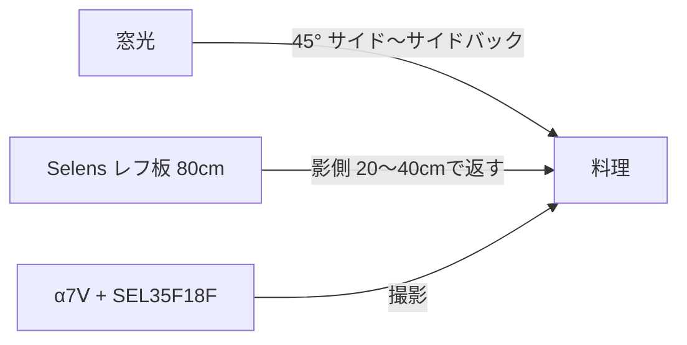
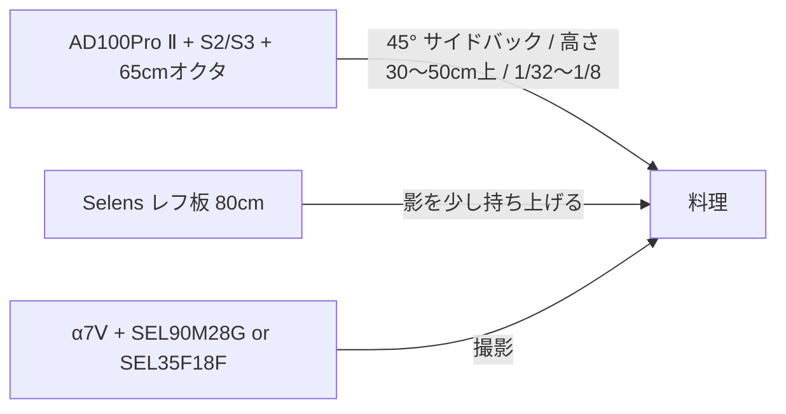
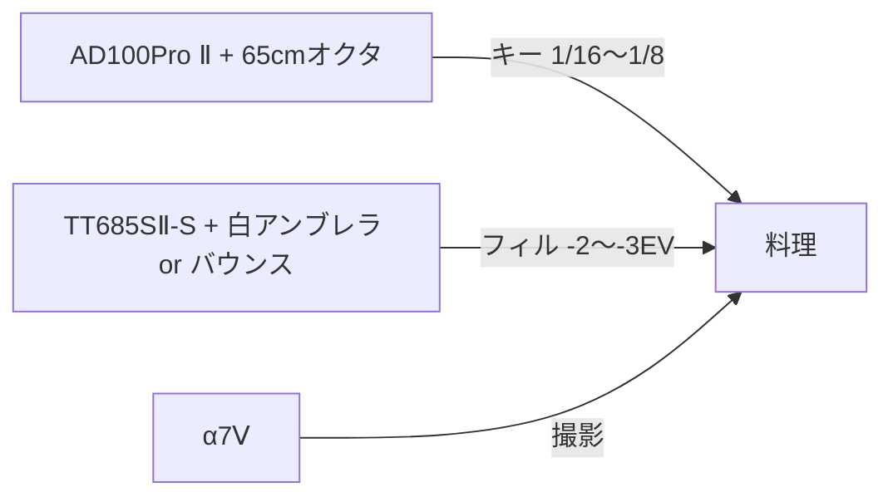

#撮影 #ライティング [[アイデア]] 

# 料理のテーブルフォト機材選定とライティング配置

## エグゼクティブサマリ

開始にあたり、私は **GitHub コネクタで `MokuSakuPhotographer/Second_Brain` を最初に参照**し、[[撮影機材一覧]] を起点に `撮影機材/` 配下の個別ファイルだけを抽出しました。本レポートは、**Second_Brain 内の「撮影機材」情報だけ**を根拠に組み立てた、制約付きの実践提案です。外部レビュー、メーカー公式仕様、価格相場による補完は行っていません。

私の結論は明快です。料理のテーブルフォトの中核は、**ボディを [[SONY α7Ⅴ]]**、**標準レンズを [[撮影機材/レンズ/SONY SEL35F18F]]**、**寄りと質感描写を [[SONY SEL90M28G]]**、**再現性の高いライティングを [[GODOX AD100Pro Ⅱ]] + [[Godox X3S]] + [[Godox S2 ブラケット Bowensマウント]] / [[Godox S3 ブラケット Bowensマウント]] + [[NEEWER 65cm 八角形ソフトボックス オクタゴン Bowensマウント]] + [[Selens 撮影用 レフ板 80cm]]**で組む構成です。[[SONY α7Ⅳ]]はサブカメラや動画兼用のバックアップとして有効です。

用途別に見ると、**カフェの卓上**は [[SONY α7Ⅴ]] + [[撮影機材/レンズ/SONY SEL35F18F]]、**商品寄り・ディテール**は [[SONY α7Ⅴ]] + [[SONY SEL90M28G]] + 三脚 + ストロボ、**料理全景や俯瞰寄り**は [[SONY α7Ⅴ]] + [[撮影機材/レンズ/TAMRON 16-30mm F／2.8 Di III VXD G2 (A064S)]]、**動画**は [[SONY α7Ⅴ]] または [[SONY α7Ⅳ]] + [[撮影機材/レンズ/TAMRON 35-100mm F2.8 Di III VXD (Model A078S)]] あるいは [[撮影機材/レンズ/SONY SEL35F18F]] + [[VL-81 LEDビデオライト]] が最も組みやすい、という判断です。[[PULUZ 撮影ボックス 60x60x60cm]] は「物撮り用」と明記されているため、皿料理よりも、小型商品・焼き菓子・パッケージ寄りの撮影に向きます。

ただし、今回の参照範囲には、**価格、最短撮影距離、最大撮影倍率、リモートレリーズ、ブームアーム、グリッド**の詳細が十分には入っていません。したがって、そうした項目は **「未指定」または「抽出範囲では未確認」** と明記し、提案の核は **保有機材の組み合わせ最適化** に置いています。各レンズファイルに共通して記載されているのは焦点距離、開放F値、用途、種類であり、近接性能の厳密比較はそこからの補助的評価になります。

## 参照範囲と前提

今回の読み取り対象は、[[撮影機材一覧]] によって束ねられた **カメラ本体、レンズ、ライティング機材、三脚・スタンド類、フィルター関連** です。そこから、料理のテーブルフォトに直接関わる実働候補だけを再構成しました。

| 区分       | 抽出した主な機材                                                                                                                                                                                                                                                                                                | このレポートでの扱い                   |
| -------- | ------------------------------------------------------------------------------------------------------------------------------------------------------------------------------------------------------------------------------------------------------------------------------------------------------- | ---------------------------- |
| ボディ      | [[SONY α7Ⅴ]] / [[SONY α7Ⅳ]] / [[SONY α7C]]                                                                                                                                                                                                                                                              | [[SONY α7Ⅴ]]を主力、[[SONY α7Ⅳ]]をサブ。[[SONY α7C]]は売却済みのため除外  |
| レンズ      | [[撮影機材/レンズ/SONY SEL35F18F]] / [[SONY SEL55F18Z]] / [[SONY SEL90M28G]] / [[SIGMA Art 85mm F1.4 DG DN]] / [[撮影機材/レンズ/TAMRON 16-30mm F／2.8 Di III VXD G2 (A064S)]] / [[撮影機材/レンズ/TAMRON 28-200mm F／2.8-5.6 Di III RXD (Model A071)]] / [[撮影機材/レンズ/TAMRON 35-100mm F2.8 Di III VXD (Model A078S)]] / [[撮影機材/レンズ/TAMRON 70-180mm F／2.8 Di III VC VXD G2]] | 料理撮影に有効な順で評価                 |
| ストロボ・定常光 | [[GODOX AD100Pro Ⅱ]] / [[GODOX TT685SⅡ-S]] / [[VL-81 LEDビデオライト]] / [[Amconsure LEDリングライト]]                                                                                                                                                                                                                               | 静止画は[[GODOX AD100Pro Ⅱ]]中心、動画は自然光または[[VL-81 LEDビデオライト]]中心 |
| 修飾具      | [[NEEWER 65cm 八角形ソフトボックス オクタゴン Bowensマウント]] / [[UNPLUGGED STUDIO 33インチ ホワイトアンブレラ]] / [[Godox ML-CD15]] / [[Godox AK-R16 磁気マウントディフューザー・カラーフィルターセット]] / [[PULUZ 撮影ボックス 60x60x60cm]]                                                                                                                                                                                                                                                 | 質感と再現性で優先順位を設定               |
| 支持具      | [[SIRUI Traveler X Ⅲ]] / [[FOSOTO ライトスタンド アルミ製]] / [[Godox FG-100]] / [[Godox S2 ブラケット Bowensマウント]] / [[Godox S3 ブラケット Bowensマウント]]                                                                                                                                                                                                                       | 三脚固定とストロボスタンド運用を中心に評価        |
| フィルター    | [[H&Y ナチュラルCPLフィルター EVO マグネット式]] / [[H&Y ブラックミスト 1／4 EVO マグネット式]] / [[H&Y NDフィルター ビデオNDキット EVO マグネット式]]                                                                                                                                                                                                                                                                        | 反射対策、雰囲気づけ、動画露出制御に活用         |

上表の根拠となる機材ファイルは以下です。[[SONY α7Ⅴ]] はメインカメラ、[[SONY α7Ⅳ]] は現在サブ運用、[[SONY α7C]] は「手放している」とメモされています。

重要な制約もあります。レンズファイルには焦点距離・開放F値・用途・種類はありますが、**最短撮影距離と最大撮影倍率は明記されていません**。したがって、近接性能については「マクロ単焦点」「物撮り」「室内撮影」といった用途欄から補助的に評価しています。価格欄もないため、表中の「予算目安」は **金額ではなく追加購入の必要有無** で表記します。

## 用途別の最適機材構成

料理のテーブルフォトは、機材のスペック競争よりも、**被写体サイズ、撮影距離、店内の自由度、求める見え方** の四つで決まります。今回の保有機材群から逆算すると、次の構成が最も合理的です。

| 用途 | ボディ | レンズ | ライティング・支持具 | 長所 | 弱点 | 追加費用目安 |
|---|---|---|---|---|---|---|
| カフェのテーブルフォト | [[SONY α7Ⅴ]] | [[撮影機材/レンズ/SONY SEL35F18F]] | 自然光 + [[Selens 撮影用 レフ板 80cm]]、必要なら三脚 | 画角が扱いやすく、席で無理なく構図を作れる | 背景整理を怠ると情報量が増えやすい | 追加購入不要 |
| 商品寄りの料理写真 | [[SONY α7Ⅴ]] | [[SONY SEL90M28G]] | [[GODOX AD100Pro Ⅱ]] + [[Godox X3S]] + [[Godox S2 ブラケット Bowensマウント]] / [[Godox S3 ブラケット Bowensマウント]] + [[NEEWER 65cm 八角形ソフトボックス オクタゴン Bowensマウント]] + 三脚 | 皿の質感、断面、ソース、湯気周辺まで丁寧に詰めやすい | 設営スペースと時間が必要 | 追加購入不要 |
| 料理全景・俯瞰寄り | [[SONY α7Ⅴ]] | [[撮影機材/レンズ/TAMRON 16-30mm F／2.8 Di III VXD G2 (A064S)]] または [[撮影機材/レンズ/TAMRON 35-100mm F2.8 Di III VXD (Model A078S)]] の35-50mm域 | [[GODOX AD100Pro Ⅱ]] + [[NEEWER 65cm 八角形ソフトボックス オクタゴン Bowensマウント]]高位置、または窓光 + レフ | 大皿、複数皿、テーブル全体の統一感を出しやすい | 広角端では歪みや端伸びに注意 | 追加購入不要 |
| 動画撮影 | [[SONY α7Ⅴ]] または [[SONY α7Ⅳ]] | [[撮影機材/レンズ/TAMRON 35-100mm F2.8 Di III VXD (Model A078S)]] / [[撮影機材/レンズ/SONY SEL35F18F]] | 窓光 + レフ、または [[VL-81 LEDビデオライト]] | 構図変更に対応しやすく、料理工程も撮りやすい | 大光量の定常光がないため、暗所では厳しい | 追加購入不要 |
| ワンレンズ省機材運用 | [[SONY α7Ⅴ]] | [[撮影機材/レンズ/TAMRON 28-200mm F／2.8-5.6 Di III RXD (Model A071)]] | 自然光 + レフ | レンズ交換が減り、移動や店内撮影で楽 | 専用構成より光量・ボケ・質感の追い込みは弱い | 追加購入不要 |

この表の構成要素は、[[SONY α7Ⅴ]]、[[SONY α7Ⅳ]]、[[撮影機材/レンズ/SONY SEL35F18F]]、[[SONY SEL90M28G]]、[[撮影機材/レンズ/TAMRON 16-30mm F／2.8 Di III VXD G2 (A064S)]]、[[撮影機材/レンズ/TAMRON 35-100mm F2.8 Di III VXD (Model A078S)]]、[[撮影機材/レンズ/TAMRON 28-200mm F／2.8-5.6 Di III RXD (Model A071)]]、[[GODOX AD100Pro Ⅱ]]、[[Godox X3S]]、[[NEEWER 65cm 八角形ソフトボックス オクタゴン Bowensマウント]]、[[Selens 撮影用 レフ板 80cm]]、[[SIRUI Traveler X Ⅲ]]、[[VL-81 LEDビデオライト]] に基づいています。

さらに、照明部材の役割を分けると、選定はより明確になります。

| メーカー | モデル | 主な役割 | 利点 | 注意点 | 追加費用目安 |
|---|---|---|---|---|---|
| Godox | [[GODOX AD100Pro Ⅱ]] | メイン光 | 最も安定した主光源。静止画の再現性が高い | カフェ現場では設営量が増える | 追加購入不要 |
| Godox | [[GODOX TT685SⅡ-S]] | フィル、アクセント、予備光 | 小回りが利き、2灯目として使いやすい | 主光源としては硬くなりやすい | 追加購入不要 |
| NEEWER | [[NEEWER 65cm 八角形ソフトボックス オクタゴン Bowensマウント]] | 質感を整える主修飾 | 食品の面光源に向く | グリッドが未登録のため spill 制御は角度頼み | 追加購入不要 |
| UNPLUGGED STUDIO | [[UNPLUGGED STUDIO 33インチ ホワイトアンブレラ]] | 柔らかい広めの光 | 手早く回り込みのある光を作れる | 小空間では回りすぎる | 追加購入不要 |
| Selens | [[Selens 撮影用 レフ板 80cm]] | 影の持ち上げ | 最も手軽に見た目を整えられる | スタンド固定情報は未確認 | 追加購入不要 |
| PULUZ | [[PULUZ 撮影ボックス 60x60x60cm]] | 小型商品・パッケージ・焼き菓子 | 背景と光を早く整えられる | 皿料理では窮屈な見た目になりやすい | 追加購入不要 |
| VIJIM/ULANZI系 | [[VL-81 LEDビデオライト]] | 動画用の補助光 | 小型で導入しやすい | 主光源としては光量不足になりやすい | 追加購入不要 |

この表の根拠は各アクセサリーファイルです。[[GODOX AD100Pro Ⅱ]] は [[Godox X3S]] と [[FOSOTO ライトスタンド アルミ製]]に対応し、[[NEEWER 65cm 八角形ソフトボックス オクタゴン Bowensマウント]]は [[Godox S2 ブラケット Bowensマウント]] / [[Godox S3 ブラケット Bowensマウント]] 経由で運用できます。[[PULUZ 撮影ボックス 60x60x60cm]] は機材メモに「物撮り用」とあります。

## レンズ評価

厳密な近接性能の数値は未記載ですが、**料理のテーブルフォトで重要なのは「寄れるか」だけではなく、「その距離で自然に見えるか」** です。その観点から、保有レンズを次のように評価します。

| メーカー | モデル | 焦点距離 | 開放F値 | 最短撮影距離 | 最大撮影倍率 | repo上の種類・用途 | 私の評価 |
|---|---|---:|---:|---|---|---|---|
| SONY | [[撮影機材/レンズ/SONY SEL35F18F]] | 35mm | F1.8 | 未記載 | 未記載 | 単焦点 / スナップ・ポートレート・日常撮影 | カフェ卓上の第一候補 |
| SONY | [[SONY SEL55F18Z]] | 55mm | F1.8 | 未記載 | 未記載 | 単焦点 / スナップ・ポートレート | 主役皿を整理して切り出しやすい |
| SONY | [[SONY SEL90M28G]] | 90mm | F2.8 | 未記載 | 未記載 | マクロ単焦点 / マクロ・物撮り・ポートレート | 商品寄り・質感描写の最有力 |
| TAMRON | [[撮影機材/レンズ/TAMRON 16-30mm F／2.8 Di III VXD G2 (A064S)]] | 16-30mm | F2.8 | 未記載 | 未記載 | 広角ズーム / 風景・スナップ・室内撮影 | 全景・俯瞰向き。ただし広角端注意 |
| TAMRON | [[撮影機材/レンズ/TAMRON 28-200mm F／2.8-5.6 Di III RXD (Model A071)]] | 28-200mm | F2.8-5.6 | 未記載 | 未記載 | 高倍率ズーム / 旅行・スナップ・万能ズーム | 省機材の便利枠 |
| TAMRON | [[撮影機材/レンズ/TAMRON 35-100mm F2.8 Di III VXD (Model A078S)]] | 35-100mm | F2.8 | 未記載 | 未記載 | 標準〜中望遠ズーム / ポートレート・イベント・スナップ | テーブルから半歩引ける環境で強い |
| TAMRON | [[撮影機材/レンズ/TAMRON 70-180mm F／2.8 Di III VC VXD G2]] | 70-180mm | F2.8 | 未記載 | 未記載 | 望遠ズーム / ポートレート・イベント・望遠 | 通常の卓上距離では優先度低い |
| SIGMA | [[SIGMA Art 85mm F1.4 DG DN]] | 85mm | F1.4 | 未記載 | 未記載 | 単焦点 / ポートレート・夜景ポートレート | 雰囲気は出るが、テーブルでは距離が要る |

上表は各レンズファイルの焦点距離、開放F値、用途、種類を統合したものです。最短撮影距離と最大撮影倍率は今回の参照範囲には入っていないため、明示的に「未記載」としています。
**標準解は 35mm です。** [[撮影機材/レンズ/SONY SEL35F18F]] は、席に座ったままでも無理のない距離で、皿単体・ドリンク・テーブルの一部をまとめやすい焦点域です。特にカフェのテーブルフォトでは、「寄りすぎて背景が狭くなる」「長すぎて引けない」という失敗が少ないため、最初に選ぶ一本として最も安定します。

**主役皿を一段整理したいなら 55mm が効きます。** [[SONY SEL55F18Z]] は背景や余計なカトラリーを切り落としやすく、皿の主題性を高めたいときに向きます。反面、卓上全体のストーリー性は35mmより作りにくくなります。

**寄りと質感は 90mm マクロが別格です。** [[SONY SEL90M28G]] は、今回の抽出範囲の中で唯一、ファイル上も明確に「マクロ単焦点」「物撮り」と位置づけられているため、商品寄り、断面、粉砂糖、ソース、グラスの水滴など、細部を見せる用途では最優先です。皿全体よりも「一部を高密度に見せる」役割と考えるのが正確です。

**全景は広角ズームを使えますが、広角端を常用しないほうが安全です。** [[撮影機材/レンズ/TAMRON 16-30mm F／2.8 Di III VXD G2 (A064S)]] は file 上でも「室内撮影」用途が付いており、俯瞰や複数皿の構成では有効です。ただし料理写真では、16mm付近を近距離で使うと皿の縁やカトラリーの形が誇張されやすいため、私ならまず 24-30mm 相当の見え方から始めます。

**一発勝負の実用枠は [[撮影機材/レンズ/TAMRON 28-200mm F／2.8-5.6 Di III RXD (Model A071)]] と [[撮影機材/レンズ/TAMRON 35-100mm F2.8 Di III VXD (Model A078S)]] です。** レンズ交換を減らしたいなら [[撮影機材/レンズ/TAMRON 28-200mm F／2.8-5.6 Di III RXD (Model A071)]]、料理も人物も店内カットもまとめたいなら [[撮影機材/レンズ/TAMRON 35-100mm F2.8 Di III VXD (Model A078S)]] が便利です。ただし、料理だけを綺麗に仕上げる専用性は、35mm単焦点や90mmマクロに劣ります。

実務上の小さな強みとして、**77mm 系のマグネットフィルター運用が組みやすい** 点があります。[[撮影機材/レンズ/SONY SEL35F18F]] は 55mm、[[SONY SEL90M28G]] は 62mm、[[撮影機材/レンズ/TAMRON 28-200mm F／2.8-5.6 Di III RXD (Model A071)]] は 67mm、[[SIGMA Art 85mm F1.4 DG DN]] は 77mm フィルター径で、[[H&Y ナチュラルCPLフィルター EVO マグネット式]]・[[H&Y ブラックミスト 1／4 EVO マグネット式]]・[[H&Y NDフィルター ビデオNDキット EVO マグネット式]]は [[H&Y ステップアップリング 55-77mm マグネット式]]・[[H&Y ステップアップリング 62-77mm マグネット式]]・[[H&Y ステップアップリング 67-77mm マグネット式]] に対応しています。つまり、反射対策や動画露出管理を複数レンズで共通化しやすい構成です。

## ライティング配置

私がこの保有機材群から組むなら、**最重要の主光源は [[GODOX AD100Pro Ⅱ]] + [[NEEWER 65cm 八角形ソフトボックス オクタゴン Bowensマウント]]**です。[[GODOX TT685SⅡ-S]] はフィル・アクセント・2灯目に回し、[[Selens 撮影用 レフ板 80cm]] は影のコントロール役、[[VL-81 LEDビデオライト]] は動画の近接補助と考えるのが最も効率的です。[[PULUZ 撮影ボックス 60x60x60cm]] は料理皿よりも、小型商品や焼き菓子の整然としたカット向けです。

**自然光 + レフ板**  
最も軽く、店内でも実行しやすい基本形です。窓を被写体の真横ではなく **45°サイド〜ややサイドバック** に置くと、皿の立体感が出やすくなります。影側には [[Selens 撮影用 レフ板 80cm]] を **20〜40cm 前後** まで近づけて、暗部だけを軽く持ち上げます。白い皿やスープなら返しを強め、黒皿や艶の強いソースならレフを少し離してコントラストを残します。レストランの空気感を残したいときは、このパターンが最も自然です。

**一灯ストロボ + [[NEEWER 65cm 八角形ソフトボックス オクタゴン Bowensマウント]] + レフ板**  
再現性を最優先するなら、これが最適解です。[[GODOX AD100Pro Ⅱ]] を [[Godox S2 ブラケット Bowensマウント]] / [[Godox S3 ブラケット Bowensマウント]] と [[NEEWER 65cm 八角形ソフトボックス オクタゴン Bowensマウント]] に組み、皿の **斜め後方45°・被写体より30〜50cm高い位置** に置き、**35〜55°程度で俯角** を付けます。距離は料理から **50〜80cm** を開始点にすると、皿全体に回りすぎず、程よい指向性が残ります。ストロボ出力は **1/32〜1/8** を起点にし、反対側はレフ板で受けて **-1.5〜-2EV 相当** の影に抑えると、ベタッとせずに食欲の出る面が作れます。[[NEEWER 65cm 八角形ソフトボックス オクタゴン Bowensマウント]]は、現状の機材群では最も優先度が高い修飾具です。

**二灯キー + フィル**  
主光源は上記と同じく [[GODOX AD100Pro Ⅱ]] + [[NEEWER 65cm 八角形ソフトボックス オクタゴン Bowensマウント]] に固定し、[[GODOX TT685SⅡ-S]] を **弱いフィル** として加えます。[[GODOX TT685SⅡ-S]] は正面から焚かず、[[UNPLUGGED STUDIO 33インチ ホワイトアンブレラ]] か壁バウンスで **-2〜-3EV 程度の補助光** に留めると、皿の手前だけ暗く潰れるのを防げます。ケーキ、パン、和食の小鉢のように凹凸が多い被写体で、テーブルの向こう側を沈ませすぎたくないときに有効です。主光は 5600K 基準、フィルも同系色に揃え、色温度を混ぜないほうが後処理は楽です。

**擬似トップライト + リム**  
今回の抽出範囲では、**ブームアームは確認できません**。したがって真上からの常設トップライトより、[[Godox FG-100]] を使って [[GODOX AD100Pro Ⅱ]] を一時的に上から差し込む、あるいはライトスタンドを高く立てて **後方上部から 60〜75°** で落とす「擬似トップ」のほうが現実的です。グラス、カレー、艶のあるソース、ラーメンの油膜のようにハイライトで美味しさを出したい被写体では、後方上部からの光が効きます。必要なら [[GODOX TT685SⅡ-S]] を逆サイド後方に弱く置いて縁だけを起こし、[[Godox ML-CD15]] で少し柔らかくします。色遊びをするなら [[Godox AK-R16 磁気マウントディフューザー・カラーフィルターセット]] のカラーフィルターも使えますが、料理本体の色再現を優先する通常運用では、まず無色で整えるべきです。

**動画用の定常光運用**  
動画は [[VL-81 LEDビデオライト]] か自然光中心になります。現在の抽出範囲では大型の高出力定常光が見当たらないため、**窓光を主光源、[[VL-81 LEDビデオライト]] を近接補助** にする発想が最も安定します。[[VL-81 LEDビデオライト]] は料理から **15〜25cm 程度まで寄せて** はじめて効く場面が多く、離すと急に力不足になります。[[Amconsure LEDリングライト]] は手元撮影やレシピ工程の簡易照明には使えますが、料理の立体感を出す主光としては平板になりやすいので、優先度は低めです。動画でシャッターを 1/50 あるいは 1/60 に固定するなら、窓際では [[H&Y NDフィルター ビデオNDキット EVO マグネット式]] が有効です。

フィルター運用も重要です。**艶の強い皿、グラス、カトラリー、テーブル天板の反射対策には CPL** が有効です。逆に、**[[H&Y ブラックミスト 1／4 EVO マグネット式]]** は空気感を柔らかくできますが、質感再現を求める料理写真ではシャープさを少し削る方向に働くため、常用よりも「夜カフェ感」「ムード演出」に限定したほうが安全です。

### ライティング配置図まとめ
![[Pasted image 20260523230125.png]]
## 撮影設定と画づくり

ここから先は、上記の保有機材だけを使う前提での **私の実務的な開始値** です。機材ファイル自体には露出設定は書かれていないため、以下は **構成から逆算した運用提案** としてお読みください。ベースは [[SONY α7Ⅴ]] / [[SONY α7Ⅳ]] と、35mm・55mm・90mm・F2.8ズーム群、そして [[GODOX AD100Pro Ⅱ]]/[[VL-81 LEDビデオライト]] の組み合わせです。

| シーン | 絞りの開始値 | シャッタースピード | ISO | WB の開始値 | 補足 |
|---|---:|---:|---:|---:|---|
| カフェ自然光の皿単体 | F2.8〜F4 | 1/80〜1/160 | 100〜800 | 4800〜5600K固定 | 背景の情報量を少し残しつつ主役を立てる |
| テーブル全体・複数皿 | F4〜F8 | 1/80〜1/160 | 100〜800 | 5000〜5600K固定 | 奥の皿まで見せるなら少し絞る |
| ストロボ静止画 | F5.6〜F8 | 1/160〜1/200 | 100 | 5500K前後固定 | [[GODOX AD100Pro Ⅱ]] は 1/32〜1/8 を開始点 |
| 90mm マクロ寄り | F8〜F11 | 1/160〜1/200 | 100 | 5500K前後固定 | 質感優先。必要なら複数カット撮影 |
| 動画 | F2.8〜F4 | 1/50 または 1/60 | 400〜1600目安 | 4500〜5600K固定 | 明るすぎるときは ND を使う |

料理写真で失敗しやすいのは、「開放に寄りすぎること」よりも **ピント面の置き方** です。皿を斜めから撮るなら、私は原則として **手前三分の一付近の最も見せたい食材** に置きます。ステーキなら断面、パスタなら主役具材、デザートならクリームかフルーツの手前側です。俯瞰では、皿のど真ん中よりも **構図の主役寄り** に置いたほうが見た目が安定します。90mm マクロでは被写界深度が浅くなるため、商品寄りは F8〜F11 前提で考え、必要なら複数カットから Photoshop 側でスタッキングする運用が現実的です。

小物配置は、**主役の料理一皿に対して、周辺要素は「二つまで」** くらいがまとまりやすいです。スプーン、ナプキン、ドリンク、追加の小皿を全部入れると、35mm では情報量過多になりやすく、55mm 以上では主役から注意が外れます。テーブル材質は、反射の強い面なら CPL を優先し、白い皿やグラスのハイライトが暴れるときはサイドバックの光に変更するのが有効です。[[H&Y ナチュラルCPLフィルター EVO マグネット式]] は今回の機材群では特に実用度が高く、逆に [[H&Y ブラックミスト 1／4 EVO マグネット式]] は「料理の輪郭を立てる日」には外したほうが素直です。

色味調整は、**ホワイトバランスを固定して撮る** ことが最優先です。自然光・暖色店内照明・ストロボを混ぜると、皿の白、クリーム、湯気の色が崩れやすくなります。私なら、窓光のみなら 5000K 前後、ストロボ主導なら 5500K 前後に固定し、後処理で微調整します。動画では 1/50 や 1/60 を守りたいので、窓際なら ND、反射が強いドリンクや光沢皿には CPL を優先する、という順序が実用的です。

## 既存機材だけで組む優先順位

今回の制約では、**予算別セット** は「追加購入額」ではなく、**既存機材だけで組む運用負荷の違い** として示すのが最も誠実です。結論として、以下の三段階で十分です。

| セット | 構成 | 向く用途 | セッティング負荷 | 追加出費 |
|---|---|---|---|---|
| 最小セット | [[SONY α7Ⅴ]] + [[撮影機材/レンズ/SONY SEL35F18F]] + 窓光 + [[Selens 撮影用 レフ板 80cm]] | カフェ、SNS、軽いレビュー写真 | 低い | 0円 |
| 標準セット | [[SONY α7Ⅴ]] + [[撮影機材/レンズ/SONY SEL35F18F]] または [[SONY SEL55F18Z]] + [[GODOX AD100Pro Ⅱ]] + [[Godox X3S]] + [[NEEWER 65cm 八角形ソフトボックス オクタゴン Bowensマウント]] + レフ板 | 自宅、再現性の高い料理写真 | 中程度 | 0円 |
| 精密セット | [[SONY α7Ⅴ]] + [[SONY SEL90M28G]] + [[SIRUI Traveler X Ⅲ]] + [[GODOX AD100Pro Ⅱ]] + [[NEEWER 65cm 八角形ソフトボックス オクタゴン Bowensマウント]] or [[PULUZ 撮影ボックス 60x60x60cm]] + CPL | 商品寄り、質感重視、メニュー化 | 高い | 0円 |
| 動画セット | [[SONY α7Ⅴ]] または [[SONY α7Ⅳ]] + [[撮影機材/レンズ/TAMRON 35-100mm F2.8 Di III VXD (Model A078S)]] + 窓光 or [[VL-81 LEDビデオライト]] + ND | 作業工程、短尺動画 | 中程度 | 0円 |

この優先順位の軸は、「自然さ」「設営時間」「再現性」の三つです。最も費用対効果が高いのは、**まず 35mm + 自然光 + レフ板で安定させること** です。その上で、料理写真を作品化・商品化したい段階で **[[GODOX AD100Pro Ⅱ]] + [[NEEWER 65cm 八角形ソフトボックス オクタゴン Bowensマウント]]** に進み、最後に **90mm マクロ + 三脚 + CPL** を投入すると、画の密度が一段上がります。

ワークフローも、この順序に合わせると簡潔です。私なら、まず **レンズを決める**、次に **主光源を一つ決める**、その後に **レフ板で影を整える**、最後に **CPL/ND などのフィルターを必要時だけ入れる**、という順で進めます。撮影では三脚が使える状況なら [[SIRUI Traveler X Ⅲ]] を優先し、商品寄りでは 90mm で数カット撮っておき、Lightroom で白バランスとハイライトを整え、Photoshop ではゴミ取りと必要時のみスタッキングを行う流れが合理的です。[[PULUZ 撮影ボックス 60x60x60cm]] は食品全般の万能解ではなく、整然と見せたい小型物撮りの専用枠として扱うと失敗が減ります。

今回の参照範囲だけで最終的に一本化するなら、私の推奨は次です。**店で撮るなら [[SONY α7Ⅴ]] + [[撮影機材/レンズ/SONY SEL35F18F]] + 自然光 + [[Selens 撮影用 レフ板 80cm]]**。**自宅で作り込むなら [[SONY α7Ⅴ]] + [[SONY SEL90M28G]] + [[GODOX AD100Pro Ⅱ]] + [[NEEWER 65cm 八角形ソフトボックス オクタゴン Bowensマウント]] + 三脚 + CPL**。この二系統を使い分ければ、マスターの Second_Brain に記録された機材だけで、料理のテーブルフォトはかなり高い完成度まで持っていけます。