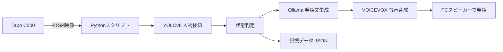

# 自律対話型機械ペット構築計画

## 概要

Tapo C200をベースに、部屋にいるマスターを見守り、反応し、自発的に発話する「自律対話型機械ペット」を構築する計画。
Tapo C200単体では複雑な自律行動や任意発話は難しいため、カメラの映像・首振り機能を外部プログラムと連携させて、機械ペットらしい振る舞いを作る。

関連ノート: [[Tapo C200 製品仕様詳細]]

## 使用する製品

- TP-Link Tapo C200
- 用途:
  - 視界の取得
  - パン・チルトによる首振り表現
  - 人物検知や映像解析の入力
  - 見守りカメラとしての常時稼働

## 実現したいこと

- 自発的に発話する。
- 自動でランダムにカメラをキョロキョロさせる。
- 人物を検知したら反応する。
- マスターの入室、離席、短時間の往復などに応じて発話内容を変える。
- 将来的には外観カスタムや移動式台座による物理的なペット化も検討する。

## これまでのプロセス

1. Tapo C200を機械ペット化する方向性を検討。
   - ソフトウェア連携による擬似人格化。
   - 外装カバーやスキンシールによる見た目のペット化。
   - 移動式台座へのマウントによる完全ロボット化。

2. 優先する機能を整理。
   - 自発的な発話。
   - ランダムな首振り。
   - 人物検知時のリアクション。

3. Home Assistant案を検討。
   - VMware Workstation Pro上にHome Assistant OSを構築する方針。
   - ブリッジ接続にして、Tapo C200とHome Assistantを同じローカルネットワークで通信させる。
   - ONVIFまたはTapo Controlを使い、カメラの映像取得やパン・チルト制御を行う案を確認。

4. 開発環境を確認。
   - サブPCで作業。
   - GPU: RTX 3080
   - CPU: Ryzen 9 3900X
   - メモリ: 64GB
   - VMware Workstation Proは導入済み。
   - iPhoneのTapoアプリでカメラが使用できることを確認済み。
   - Tapoアカウントとカメラアカウントは作成済み。

5. Home AssistantでTapo C200の接続を確認。
   - ONVIF統合を使う流れを確認。
   - ポートは2020を使用する想定。
   - mainstreamでカメラ映像がリアルタイムに稼働していることを確認済み。

6. Pythonスクリプトによる自律処理へ発展。
   - RTSP映像をPythonで取得。
   - YOLOv8で人物を検知。
   - Ollamaで発話文を生成。
   - VOICEVOXで音声合成し、PC側で再生。
   - 入室、離席、滞在時間、短時間の往復を記憶し、発話内容に反映する構成へ進めている。

## 現在の構成

## 使用しているプログラム・言語・ツール

| 種類 | 使用しているもの | 役割 |
|---|---|---|
| カメラ | Tapo C200 | 映像取得、首振り、見守り |
| スマホアプリ | Tapoアプリ | 初期設定、カメラアカウント作成、接続確認 |
| 仮想環境 | VMware Workstation Pro | Home Assistant OSの実行環境 |
| スマートホーム基盤 | Home Assistant | ONVIF連携や自動化の候補 |
| カメラ連携 | ONVIF、RTSP | カメラ制御と映像取得 |
| 実装言語 | Python | 自律処理全体の制御 |
| 映像処理 | OpenCV | RTSPフレーム取得、画像変換 |
| 人物検知 | YOLOv8、yolov8n.pt | フレーム内の人物検出 |
| AI発話生成 | Ollama、qwen2.5vl:7b | 状況に応じた日本語セリフ生成 |
| 音声合成 | VOICEVOX | 生成したテキストの読み上げ |
| 音声再生 | winsound | 生成音声ファイルの再生 |
| 通信 | requests | OllamaとVOICEVOXへのHTTPリクエスト |
| 状態記憶 | JSON | 入室時刻、離席時刻、短時間往復履歴の保存 |

## Python側の処理概要

計画書では、`ai_pet_brain.py` というPythonスクリプトを中心に構築している。

主な処理は以下。

- RTSP URLからTapo C200の映像を取得する。
- YOLOv8で人物を検出する。
- 人物を初めて検知したら、マスターの入室として扱う。
- 人物が一定時間見えなくなったら、離席として扱う。
- 短時間に入退室が繰り返された場合は、`busy_moving` として扱う。
- 状況に応じてOllamaへ発話文生成を依頼する。
- VOICEVOXで音声を生成する。
- 生成した音声をPC側で再生する。

## 発話パターン

| 状態 | 内容 |
|---|---|
| enter | マスターが席に戻ったときの挨拶 |
| leave | マスターが部屋を出たときの見送り |
| busy_moving | 短時間に何度も出入りしたときの気遣い |
| random | マスターがいる間の自律的な雑談 |

## これまでに発生した課題と対応

| 課題 | 対応 |
|---|---|
| Tapo C200単体では任意の自発発話が難しい | 外部スピーカー、VOICEVOX、PC再生に寄せる |
| 視覚認識つきのOllama応答が15秒でタイムアウトする | 画像を送る `random` のときだけタイムアウトを45秒に延長 |
| 生成される日本語の助詞が不自然になる | プロンプトで正しい日本語の開始文や禁止表現を明示 |
| RTSP切断の可能性 | ストリーム切断時に再接続する処理を入れる |

## 今後の作業予定

- 現在のPythonスクリプトを安定稼働させる。
- 日本語発話の自然さを改善する。
- `busy_moving`、`enter`、`leave`、`random` の発話品質を個別に調整する。
- 長時間稼働テストを行い、RTSP再接続、Ollama応答時間、VOICEVOX再生の安定性を確認する。
- ランダム首振りや注視動作を、PythonまたはHome Assistant側から制御する。
- 必要であればHome Assistant連携とPython単独運用の役割分担を整理する。
- 外装カスタムや台座追加を検討する。

## 未確定・要確認

- Tapo C200のパン・チルトをPython側からどの方式で安定制御するか。
- Home Assistantを最終構成に残すか、Python単独構成に寄せるか。
- 内蔵スピーカーを使った任意発話が可能か。
- 長時間稼働時のカメラ、PC、VOICEVOX、Ollamaの負荷。
- qwen2.5vl:7b以外のモデルを使う場合の日本語品質と応答速度。
- 発話頻度が多すぎないか、生活の邪魔にならないか。

## メモ

現時点では、Tapo C200を「身体」として直接改造するよりも、RTSP映像、人物検知、Ollama、VOICEVOXを組み合わせたソフトウェア人格化が中心。
首振りや外装カスタムは、発話と人物検知が安定した後に進めると整理しやすい。
